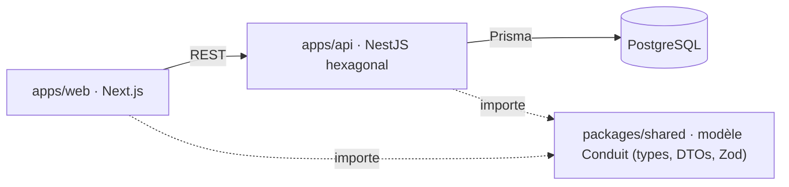

# conduit-fullstack

Implémentation **full-stack TypeScript** de [Conduit](https://realworld-docs.netlify.app/)
(la spec **RealWorld** : un clone de Medium, avec articles, commentaires, favoris et suivi
d'auteurs). Monorepo `api` + `web` + `shared`, tenu comme un vrai projet de production.

Ce dépôt n'est pas une démo jetable : c'est la **matérialisation vivante** d'une méthode
de craft. Chaque garde-fou (config, hook, test de contrat, workflow CI, migration) est un
vrai fichier commenté, lisible sans contexte additionnel, pensé pour montrer *comment on
lance et on tient un projet full-stack de A à Z*.

## Sommaire

- [Qui je suis, et pourquoi ce projet](#qui-je-suis-et-pourquoi-ce-projet)
- [Ce que ce repo implémente : Le Référentiel Craft](#ce-que-ce-repo-implémente--le-référentiel-craft)
- [Le projet Conduit (RealWorld)](#le-projet-conduit-realworld)
- [Le parti pris](#le-parti-pris)
- [Architecture](#architecture)
- [La boîte à outils](#la-boîte-à-outils)
- [Démarrage rapide](#démarrage-rapide)
- [Commandes](#commandes)
- [Structure](#structure)
- [Décisions d'architecture](#décisions-darchitecture)
- [Statut](#statut)
- [Contexte éditorial](#contexte-éditorial)
- [Licence](#licence)

## Qui je suis, et pourquoi ce projet

Je suis Kamanga ([@kamangacode sur LinkedIn](https://www.linkedin.com/in/kamangacode/)) :
coach craft et engineering leader. Vingt-cinq ans de métier, et tous les rôles au fil du
temps : développeur, tech lead, engineering manager, directeur technique, coach. J'ai
travaillé sur des systèmes où l'enjeu économique du logiciel est bien réel, chez BNP
Paribas, Crédit Agricole, Canal+ ou Agirc-Arrco. Un double regard, business et technique.
Et je développe encore aujourd'hui, par passion.

Sur toutes ces années, j'ai vu les mêmes problèmes revenir, sur du neuf comme sur du
legacy, dans des contextes qui n'avaient rien à voir. Ce qui sépare un projet qui tient
dans le temps d'un projet qui devient ingérable, ce n'est presque jamais le talent. C'est
le cadre : les pratiques et les garde-fous posés dès le premier jour.

Ce dépôt existe pour rendre ce cadre **concret et vérifiable**. Mon objectif en le
construisant : montrer comment lancer un projet full-stack proprement, de A à Z, avec une
implémentation *complète* de l'outillage et des bonnes pratiques attendues sur un projet de
cette envergure, et montrer aussi tout le [cycle de développement (SDLC) et le workflow
agentique](#la-boîte-à-outils) que j'utilise au quotidien. Pas des slides : des fichiers
que tu peux ouvrir, lire et rejouer.

Mon positionnement, en une phrase : **code mieux que l'IA, pas comme elle**. L'IA est un
outil ; le craft est un métier. Ce repo est la preuve de ce que ce métier produit quand il
est tenu jusqu'au bout.

> Retrouve-moi sur [LinkedIn](https://www.linkedin.com/in/kamangacode/) et
> [kamanga.fr](https://kamanga.fr). Sur la maturité d'ingénierie, mon repère :
> [les 5 niveaux](https://www.kamanga.fr/fr/dette-technique/introduction-maturite-engineering-5-niveaux).

## Ce que ce repo implémente : Le Référentiel Craft

Ce dépôt est l'**implémentation vivante** d'un produit : [**Le Référentiel
Craft**](https://www.kamanga.fr/referentiel-craft). Vingt-cinq ans de software
craftsmanship condensés en 100 pratiques, organisées sur 21 phases, du premier commit
jusqu'à la prod.

Le référentiel répond à *quelles pratiques existent, et pourquoi*. `conduit-fullstack`
répond à *à quoi elles ressemblent une fois posées dans un vrai repo* : chaque pratique du
référentiel (dépôt protégé, ADR, conventions de commit, TDD, revue de code, quality gates,
sécurité by design) a ici son fichier réel, commenté, qui tourne en CI.

Le référentiel donne la grille ; ce repo en est la démonstration exécutable. Les deux se
lisent ensemble.

## Le projet Conduit (RealWorld)

Pour démontrer une méthode, il faut un produit à construire. J'ai choisi
**[RealWorld](https://github.com/gothinkster/realworld)** (nom de code *Conduit*) : une
**spécification** conçue pour s'entraîner à bâtir un produit complet plutôt qu'un
énième todo-list.

Conduit est un **clone de Medium** : inscription et authentification, publication
d'articles en Markdown, commentaires, favoris, suivi d'auteurs, fil personnalisé, tags.
Le périmètre fonctionnel est figé par la spec (endpoints, formes de données, parcours),
ce qui en fait un **banc d'essai idéal** : puisque le *quoi* est fixé, toute l'attention se
porte sur le *comment*.

L'intérêt est là : on peut réimplémenter **la même application, sous les mêmes contraintes,
dans autant de langages et de stacks qu'on veut**, et comparer les choix d'architecture à
périmètre constant. Ce dépôt-ci en est la version **full-stack TypeScript**. La spec ne
bouge pas ; la manière de la servir, si.

## Le parti pris

Le problème central d'une app front/back est la **cohérence du modèle** : les formes
métier, les DTOs et les règles de validation doivent rester identiques des deux côtés.
Une divergence silencieuse entre ce que l'API renvoie et ce que le front attend est une
classe de bugs entière : détectée tard, au runtime.

Une implémentation classique (un back-end Java, un front séparé) résout ce couplage par un
**contrat externe** (OpenAPI) que le back expose et que le front consomme : un contrat à
garder synchronisé des deux côtés.

Ce dépôt prend l'autre chemin. Le modèle Conduit est **écrit une seule fois**, dans
`packages/shared`, et importé par l'API comme par le front. La cohérence n'est plus un
contrat à maintenir : c'est une **dépendance de compilation**. Si le modèle change, ce qui
ne suit pas ne compile plus, côté front comme côté back. Le compilateur TypeScript est le
contrat.

Le domaine ne change pas (la même app RealWorld) ; ce qui change, c'est la **stratégie de
partage du modèle**. Voir [`docs/adr/001`](docs/adr/001-topologie-monorepo-modele-partage.md).

## Architecture



| Workspace | Stack | Rôle | Dépend de |
|---|---|---|---|
| `packages/shared` | TypeScript pur + Zod | Source de vérité unique du modèle Conduit | rien |
| `apps/api` | NestJS · Prisma · PostgreSQL | API REST hexagonale (`domain`/`application`/`infrastructure`/`interface`) | `shared` |
| `apps/web` | Next.js App Router · React · TanStack Query | UI RealWorld, client REST typé | `shared` |

Le `domain` de l'API reste **pur** : aucun import de NestJS ni de Prisma. La discipline
hexagonale n'est pas troquée contre la facilité du full-stack.

## La boîte à outils

C'est ici que le repo raconte le plus. Une application durable, ce n'est pas seulement du
code métier : c'est une [boîte à outils
craft](https://www.kamanga.fr/fr/dette-technique/boite-a-outils-craft-app-durable) posée
autour, qui l'empêche de pourrir. Le sommaire ci-dessous reprend, catégorie par catégorie,
l'outillage complet d'un projet production-grade, avec le même découpage que celui du
[Référentiel Craft](https://www.kamanga.fr/referentiel-craft).

Chaque chapitre est résumé en une ligne, avec son **statut** dans ce repo (✅ en place,
🚧 en cours ou à venir) et un **article** qui creuse le sujet. Le repo se construisant par
phases, le statut est une photo de l'avancement, pas une promesse.

| # | Chapitre | En quelques mots | Statut | Pour aller plus loin |
|---|----------|------------------|--------|----------------------|
| 1 | **Orchestration du monorepo** | Turborepo + pnpm workspaces : tâches en cache, dans le bon ordre de dépendance ; `@repo/shared` lié sans publication npm. | ✅ | [Le Référentiel Craft](https://www.kamanga.fr/referentiel-craft) |
| 2 | **Langage & types** | TypeScript `strict` partout : les erreurs de type sont attrapées à la compilation, pas en prod. | ✅ | [Le Référentiel Craft](https://www.kamanga.fr/referentiel-craft) |
| 3 | **Lint, formatage & architecture** | Biome (lint + format), dependency-cruiser (frontières hexagonales), knip (code mort). | ✅ | [Outils d'analyse statique en 2026](https://www.kamanga.fr/fr/dette-technique/outils-analyse-statique-2026) |
| 4 | **Tests** | Vitest (unit + intégration sur Postgres jetable) et Playwright (parcours RealWorld, Page Object Model). | ✅ | [Les frameworks de tests](https://www.kamanga.fr/fr/dette-technique/decouvrir-frameworks-tests-java) |
| 5 | **Domaine & runtime** | Prisma (persistance typée derrière un port), Zod (parse, don't validate), domaine pur sans dépendance framework. | ✅ | [Architecture hexagonale, exemples](https://www.kamanga.fr/fr/architecture-craft/architecture-hexagonale-java-exemples-bonnes-pratiques) |
| 6 | **Frontend (état & données)** | TanStack Query pour le cache serveur (stale-while-revalidate) ; état UI pur isolé côté client. | 🚧 | [Le Référentiel Craft](https://www.kamanga.fr/referentiel-craft) |
| 7 | **Git hooks** | Lefthook en pre-commit / pre-push : lint, secrets, typecheck, tests, migrations, tout le shift-left avant la CI. | ✅ | [Le Référentiel Craft](https://www.kamanga.fr/referentiel-craft) |
| 8 | **CI/CD, GitHub Actions** | Workflow avec `concurrency`, filtre de chemins, cron de drift, et un job agrégateur comme unique check requis. | ✅ | [Les fondamentaux de l'intégration continue](https://www.kamanga.fr/fr/pratiques-agiles/continuous-integration-fondamentaux) |
| 9 | **Sécurité & supply chain** | Dependabot groupé, `pnpm audit` ciblé prod, contrôle de licences ; scanners de secrets et de CVE en renfort. | 🚧 | [Dependabot, coéquipier silencieux](https://www.kamanga.fr/fr/dette-technique/dependabot-craft-gestion-dependances) |
| 10 | **Sécurité HTTP & auth** | En-têtes de sécurité, rate limiting, authentification argon2id + JWE (`jose`). Paiement et emailing : hors périmètre RealWorld. | 🚧 | [Le Référentiel Craft](https://www.kamanga.fr/referentiel-craft) |
| 11 | **Observabilité** | Suivi d'erreurs et monitoring synthétique des parcours critiques (login, publication). | 🚧 | [Le Référentiel Craft](https://www.kamanga.fr/referentiel-craft) |
| 12 | **Hébergement & déploiement** | Docker/compose pour les bases de dev et de test isolées ; déploiement continu conditionné à une CI verte. | 🚧 | [Le Référentiel Craft](https://www.kamanga.fr/referentiel-craft) |
| 13 | **Couverture & traçabilité** | Matrice de traçabilité exigences vers tests générée en CI ; couverture de lignes gatée sur le diff. | 🚧 | [La Definition of Done](https://www.kamanga.fr/fr/dette-technique/definition-of-done-qualite) |
| 14 | **Workflow agentique & SDLC** | Un cycle outillé où chaque incrément est cadré, implémenté, vérifié et relu sous gates humaines : plans reprisables, mémoire des décisions, revue adversariale. | ✅ | [Évaluer un outil IA pour son équipe](https://www.kamanga.fr/fr/intelligence-artificielle/evaluer-outil-ia-equipe-adoption) |

## Démarrage rapide

Prérequis : **Node ≥ 20** (voir [`.nvmrc`](.nvmrc)), **pnpm 10**, **Docker**.

```bash
# 1. Dépendances runtime locales (Postgres + Adminer + Mailpit)
docker compose up -d

# 2. Dépendances du monorepo
pnpm install

# 3. Configuration : partir des gabarits commentés
cp .env.example .env                    # stack docker (ports, identifiants locaux)
cp apps/api/.env.example apps/api/.env  # process API
#    Puis générer le secret JWT : openssl rand -hex 32

# 4. Base de données : appliquer les migrations
pnpm --filter @repo/api db:migrate:deploy

# 5. Démarrer api + web en parallèle
pnpm dev
```

L'API **valide son environnement au démarrage** et refuse de booter si une
variable manque ou est malformée, en nommant les variables fautives
([`apps/api/src/config/env.ts`](apps/api/src/config/env.ts)). Une configuration
incomplète produit une erreur immédiate, pas une 500 à la troisième requête.

- API : http://localhost:3001 (sonde : `GET /health`)
- Web : http://localhost:3000
- Adminer (inspection DB) : http://localhost:8080
- Mailpit (e-mails de dev) : http://localhost:8025

## Commandes

```bash
pnpm dev          # api + web en parallèle (Turborepo)
pnpm build        # build des 3 workspaces
pnpm lint         # lint (Biome, Phase 1)
pnpm typecheck    # typecheck TypeScript
pnpm test         # tests unitaires (Vitest, Phase 4)
pnpm --filter @repo/api db:migrate   # créer/appliquer une migration Prisma
```

## Structure

```
conduit-fullstack/
├── apps/
│   ├── api/   # NestJS hexagonal : domain / application / infrastructure / interface
│   │   └── prisma/   # schema.prisma + migrations versionnées
│   └── web/   # Next.js App Router
├── packages/
│   └── shared/   # modèle Conduit : types + DTOs + enums + schémas Zod
├── docs/adr/     # Architecture Decision Records
└── docker-compose.yml
```

## Décisions d'architecture

Les choix techniques significatifs sont tracés dans [`docs/adr/`](docs/adr/) : de la
topologie du monorepo au modèle de données, en passant par l'authentification et la
conformité à la suite de tests officielle RealWorld. Quelques points d'entrée :

- [001 : Topologie monorepo et partage du modèle](docs/adr/001-topologie-monorepo-modele-partage.md)
- [002 : Modèle de données Conduit (Prisma / PostgreSQL)](docs/adr/002-modele-donnees-prisma.md)
- [007 : Authentification argon2id + jose](docs/adr/007-authentification-argon2id-jose.md)
- [018 : Conformité à la suite E2E officielle vendorée](docs/adr/018-conformite-e2e-suite-officielle-vendoree.md)

## Statut

En construction. Le squelette est bootable (l'API répond, le front s'affiche, les trois
workspaces compilent) et une part de l'outillage production-grade est déjà en place :
monorepo, lint, hooks, CI, tests, dépendances (voir les statuts dans [La boîte à
outils](#la-boîte-à-outils)). L'implémentation fonctionnelle restante et les chapitres
marqués 🚧 arrivent par phases successives.

## Contexte éditorial

Ce dépôt est une **vitrine de craft**, et le **pivot** d'une roadmap éditoriale : chaque
garde-fou technique qu'il porte (config, hook, test de contrat, migration…) est un vrai
fichier commenté, pensé pour être lisible sans contexte additionnel, et potentiellement la
matière d'un article qui pointe dessus. Le principe que je suis, **1 outil = 1 fichier réel
= 1 article**, fait partie des conventions formalisées dans [Le Référentiel
Craft](https://www.kamanga.fr/referentiel-craft). Écrits associés sur
[kamanga.fr](https://kamanga.fr).

## Licence

MIT.
</content>
