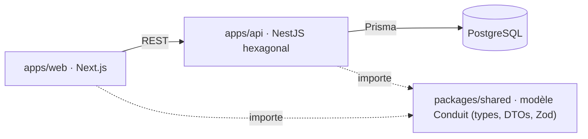

# conduit-fullstack

Un vrai projet **full-stack TypeScript**, pensé pour montrer le software craft de A à Z :
l'app [Conduit](https://realworld-docs.netlify.app/) (la spec **RealWorld**, un clone de
Medium avec articles, commentaires, favoris et suivi d'auteurs), tenue comme un vrai projet
de production. Monorepo `api` + `web` + `shared`, en NestJS + Next.js + Zod.

Ce dépôt n'est pas une démo jetable : c'est la **matérialisation vivante** d'une méthode de
craft. Architecture hexagonale, DDD, Clean Architecture, TDD, tests Vitest + Playwright, CI
et sécurité by design : chaque principe a ici son fichier réel, commenté, lisible sans
contexte additionnel. Pas des slides, des fichiers que tu peux ouvrir, lire et rejouer.

## Sommaire

- [Qui je suis, et pourquoi ce projet](#qui-je-suis-et-pourquoi-ce-projet)
- [Ce que ce repo implémente : Le Référentiel Craft](#ce-que-ce-repo-implémente--le-référentiel-craft)
- [Le projet Conduit (RealWorld)](#le-projet-conduit-realworld)
- [Le parti pris](#le-parti-pris)
- [Architecture](#architecture)
- [Le modèle partagé](#le-modèle-partagé)
- [Le backend en profondeur](#le-backend-en-profondeur)
    - [Architecture hexagonale (ports et adapters)](#architecture-hexagonale-ports-et-adapters)
    - [Domain-Driven Design (DDD)](#domain-driven-design-ddd)
    - [Clean Architecture](#clean-architecture)
    - [Principes SOLID](#principes-solid)
    - [Base de données et migrations](#base-de-données-et-migrations)
- [Le frontend (Next.js, App Router)](#le-frontend-nextjs-app-router)
- [Stratégie de tests et discipline de code](#stratégie-de-tests-et-discipline-de-code)
    - [Tests end-to-end](#tests-end-to-end)
    - [Couverture de tests](#couverture-de-tests)
    - [Qualité du code](#qualité-du-code)
    - [Traçabilité](#traçabilité)
    - [Requirements as code](#requirements-as-code)
    - [Sécurité by design](#sécurité-by-design)
    - [Documentation as code](#documentation-as-code)
- [Le cycle de développement](#le-cycle-de-développement)
- [Livraison et collaboration](#livraison-et-collaboration)
    - [Conventions de commit](#conventions-de-commit)
    - [Versioning et release](#versioning-et-release)
    - [Décisions d'architecture (ADR)](#décisions-darchitecture-adr)
    - [Processus de review](#processus-de-review)
    - [Déploiement et hébergement](#déploiement-et-hébergement)
- [La boîte à outils](#la-boîte-à-outils)
- [Démarrage rapide](#démarrage-rapide)
- [Commandes](#commandes)
- [Structure](#structure)
- [Décisions d'architecture](#décisions-darchitecture)
- [Statut](#statut)
- [Contexte éditorial](#contexte-éditorial)
- [Licence](#licence)

## Qui je suis, et pourquoi ce projet

Je suis Kamanga ([@kamangacode sur LinkedIn](https://www.linkedin.com/in/kamangacode/)) :
coach craft et engineering leader. Vingt-cinq ans de métier, et tous les rôles au fil du
temps : développeur, tech lead, engineering manager, directeur technique, coach. J'ai
travaillé sur des systèmes où l'enjeu économique du logiciel est bien réel, chez BNP
Paribas, Crédit Agricole, Canal+ ou Agirc-Arrco. Un double regard, business et technique.
Et je développe encore aujourd'hui, par passion.

Sur toutes ces années, j'ai vu les mêmes problèmes revenir, sur du neuf comme sur du
legacy, dans des contextes qui n'avaient rien à voir. Ce qui sépare un projet qui tient
dans le temps d'un projet qui devient ingérable, ce n'est presque jamais le talent. C'est
le cadre : les pratiques et les garde-fous posés dès le premier jour.

Ce dépôt existe pour rendre ce cadre **concret et vérifiable**. Mon objectif en le
construisant : montrer comment lancer un projet full-stack proprement, de A à Z, avec une
implémentation *complète* de l'outillage et des bonnes pratiques attendues sur un projet de
cette envergure, et montrer aussi tout le [cycle de développement (SDLC) et le workflow
agentique](#la-boîte-à-outils) que j'utilise au quotidien. Pas des slides : des fichiers
que tu peux ouvrir, lire et rejouer.

Mon positionnement, en une phrase : **code mieux que l'IA, pas comme elle**. L'IA est un
outil ; le craft est un métier. Ce repo est la preuve de ce que ce métier produit quand il
est tenu jusqu'au bout.

> Retrouve-moi sur [LinkedIn](https://www.linkedin.com/in/kamangacode/) et
> [kamanga.fr](https://kamanga.fr). Sur la maturité d'ingénierie, mon repère :
> [les 5 niveaux](https://www.kamanga.fr/fr/dette-technique/introduction-maturite-engineering-5-niveaux).

## Ce que ce repo implémente : Le Référentiel Craft

Ce dépôt est l'**implémentation vivante** d'un produit : [**Le Référentiel
Craft**](https://www.kamanga.fr/referentiel-craft). Vingt-cinq ans de software
craftsmanship condensés en 100 pratiques, organisées sur 21 phases, du premier commit
jusqu'à la prod.

Le référentiel répond à *quelles pratiques existent, et pourquoi*. `conduit-fullstack`
répond à *à quoi elles ressemblent une fois posées dans un vrai repo* : chaque pratique du
référentiel (dépôt protégé, ADR, conventions de commit, TDD, revue de code, quality gates,
sécurité by design) a ici son fichier réel, commenté, qui tourne en CI.

Le référentiel donne la grille ; ce repo en est la démonstration exécutable. Les deux se
lisent ensemble.

## Le projet Conduit (RealWorld)

Pour démontrer une méthode, il faut un produit à construire. J'ai choisi
**[RealWorld](https://github.com/gothinkster/realworld)** (nom de code *Conduit*) : une
**spécification** conçue pour s'entraîner à bâtir un produit complet plutôt qu'un
énième todo-list.

Conduit est un **clone de Medium** : inscription et authentification, publication
d'articles en Markdown, commentaires, favoris, suivi d'auteurs, fil personnalisé, tags.
Le périmètre fonctionnel est figé par la spec (endpoints, formes de données, parcours),
ce qui en fait un **banc d'essai idéal** : puisque le *quoi* est fixé, toute l'attention se
porte sur le *comment*.

L'intérêt est là : on peut réimplémenter **la même application, sous les mêmes contraintes,
dans autant de langages et de stacks qu'on veut**, et comparer les choix d'architecture à
périmètre constant. Ce dépôt-ci en est la version **full-stack TypeScript**. La spec ne
bouge pas ; la manière de la servir, si.

## Le parti pris

Le problème central d'une app front/back est la **cohérence du modèle** : les formes
métier, les DTOs et les règles de validation doivent rester identiques des deux côtés.
Une divergence silencieuse entre ce que l'API renvoie et ce que le front attend est une
classe de bugs entière : détectée tard, au runtime.

Une implémentation classique (un back-end Java, un front séparé) résout ce couplage par un
**contrat externe** (OpenAPI) que le back expose et que le front consomme : un contrat à
garder synchronisé des deux côtés.

Ce dépôt prend l'autre chemin. Le modèle Conduit est **écrit une seule fois**, dans
`packages/shared`, et importé par l'API comme par le front. La cohérence n'est plus un
contrat à maintenir : c'est une **dépendance de compilation**. Si le modèle change, ce qui
ne suit pas ne compile plus, côté front comme côté back. Le compilateur TypeScript est le
contrat.

Le domaine ne change pas (la même app RealWorld) ; ce qui change, c'est la **stratégie de
partage du modèle**. Voir [`docs/adr/001`](docs/adr/001-topologie-monorepo-modele-partage.md).

## Architecture



| Workspace | Stack | Rôle | Dépend de |
|---|---|---|---|
| `packages/shared` | TypeScript pur + Zod | Source de vérité unique du modèle Conduit | rien |
| `apps/api` | NestJS · Prisma · PostgreSQL | API REST hexagonale (`domain`/`application`/`infrastructure`/`interface`) | `shared` |
| `apps/web` | Next.js App Router · React · TanStack Query | UI RealWorld, client REST typé | `shared` |

Le `domain` de l'API reste **pur** : aucun import de NestJS ni de Prisma. La discipline
hexagonale n'est pas troquée contre la facilité du full-stack.

## Le modèle partagé

La section [Le parti pris](#le-parti-pris) l'annonce, [`packages/shared`](packages/shared/src/index.ts)
le rend concret. Ce package ne dépend d'aucun framework (ni NestJS, ni React) : c'est du
TypeScript pur, importé par l'API comme par le front.

Ce qu'il porte :

- Le **modèle Conduit** dans [`packages/shared/src/model/`](packages/shared/src/model) : [`article`](packages/shared/src/model/article.ts), [`comment`](packages/shared/src/model/comment.ts), [`profile`](packages/shared/src/model/profile.ts), [`user`](packages/shared/src/model/user.ts), [`tag`](packages/shared/src/model/tag.ts), [`pagination`](packages/shared/src/model/pagination.ts).
- Le **contrat d'erreurs** partagé dans [`packages/shared/src/errors/`](packages/shared/src/errors) : codes, messages et erreurs de validation, pour que l'API et le front nomment les mêmes échecs de la même façon ([ADR 017](docs/adr/017-messages-du-contrat-dans-shared.md)).

Le parti pris d'écriture : le **schéma Zod est l'unique définition**, le type TypeScript en
est inféré (`z.infer`). Une règle de validation n'existe qu'à un seul endroit, et un type
ne peut pas diverger de la validation censée le garantir. Conséquence directe : si le modèle
change ici, ce qui ne suit pas ne compile plus, côté front comme côté back.

L'approche opposée, à comparer : exposer un contrat externe que le front consomme, comme
avec [une API-first en OpenAPI](https://www.kamanga.fr/fr/architecture-craft/api-first-openapi-spring-boot).

## Le backend en profondeur

Le cœur de `apps/api` n'est pas un empilement de bonnes intentions. Trois cadres qui se
recouvrent y sont posés concrètement, et les principes SOLID en découlent presque
mécaniquement. Voici lesquels, et surtout où les lire dans le code.

### Architecture hexagonale (ports et adapters)

Le principe : le cœur métier ne dépend d'aucune technologie. Il expose des **ports**
(interfaces), et l'infrastructure fournit des **adapters** qui les implémentent. On peut
remplacer la base, le hasher de mots de passe ou la lib de tokens sans toucher une ligne de
domaine.

Dans ce repo :

- Les ports vivent dans le domaine : [`domain/user/ports/user-repository.port.ts`](apps/api/src/domain/user/ports/user-repository.port.ts), [`password-hasher.port.ts`](apps/api/src/domain/user/ports/password-hasher.port.ts), [`token-service.port.ts`](apps/api/src/domain/user/ports/token-service.port.ts).
- Les adapters vivent dans l'infrastructure : [`prisma-user.repository.ts`](apps/api/src/infrastructure/persistence/prisma-user.repository.ts), [`argon2-password-hasher.ts`](apps/api/src/infrastructure/security/argon2-password-hasher.ts), [`jose-token.service.ts`](apps/api/src/infrastructure/security/jose-token.service.ts).
- Le domaine ne connaît ni Prisma ni NestJS : aucun `import` technique dans [`domain/`](apps/api/src/domain).

À lire : [Architecture hexagonale, exemples et bonnes pratiques](https://www.kamanga.fr/fr/architecture-craft/architecture-hexagonale-java-exemples-bonnes-pratiques).

### Domain-Driven Design (DDD)

Le principe : modéliser le logiciel avec le vocabulaire du métier, en s'appuyant sur des
building blocks tactiques (Aggregate, Value Object, Domain Error, Repository) et un
découpage en bounded contexts.

Dans ce repo :

- **Bounded contexts** : un sous-dossier de domaine par concept RealWorld ([`user`](apps/api/src/domain/user), [`article`](apps/api/src/domain/article), [`comment`](apps/api/src/domain/comment), [`profile`](apps/api/src/domain/profile), [`tag`](apps/api/src/domain/tag)).
- **Aggregate Root** immuable : [`domain/article/article.ts`](apps/api/src/domain/article/article.ts), dont les méthodes métier (`favorite`, `addTag`) retournent un nouvel `Article` ou lèvent une erreur de domaine.
- **Value Object** validé au constructeur : [`domain/article/slug.ts`](apps/api/src/domain/article/slug.ts).
- **Domain Error** pure, code d'erreur porté par le domaine : [`domain/shared/errors/domain.error.ts`](apps/api/src/domain/shared/errors/domain.error.ts).
- **Ubiquitous language** : le code parle `slug`, `favorite`, `follow`, `feed`, `tagList`, exactement comme la spec.
- **Shared Kernel** : `packages/shared` porte les DTOs et schémas, consommés par l'API et le web sans redéfinition.

À lire : [Découvrir le Domain-Driven Design](https://www.kamanga.fr/fr/architecture-craft/decouvrir-domain-driven-design-ddd-avantages-exemples-java).

### Clean Architecture

Le principe : la **règle de dépendance** (Robert C. Martin). Les dépendances pointent
toujours vers l'intérieur ; les use cases orchestrent le domaine sans rien savoir du web ni
de la base.

Dans ce repo, quatre couches :

1. [`domain/`](apps/api/src/domain) : entités, value objects, ports, erreurs. TypeScript pur.
2. [`application/`](apps/api/src/application) : un use case par action, dépendant seulement de ports ([`create-article.use-case.ts`](apps/api/src/application/article/create-article.use-case.ts), [`favorite-article.use-case.ts`](apps/api/src/application/article/favorite-article.use-case.ts)).
3. [`infrastructure/`](apps/api/src/infrastructure) : adapters, et la traduction erreur de domaine vers code HTTP dans [`domain-exception.filter.ts`](apps/api/src/infrastructure/filters/domain-exception.filter.ts). L'infra traduit, le domaine reste pur.
4. [`interface/`](apps/api/src/interface) : controllers NestJS qui valident (Zod), mappent et délèguent, sans logique métier.

À lire : [Clean Architecture, les 3 règles qui comptent](https://www.kamanga.fr/fr/architecture-craft/clean-architecture-3-regles).

### Principes SOLID

Ils ne sont pas plaqués après coup : ils tombent presque tout seuls dès qu'on tient
l'hexagonal et la règle de dépendance. Où les voir concrètement :

| Principe | Où, dans ce repo | Article |
|---|---|---|
| **S**RP, responsabilité unique | Un use case = une action. Le dossier [`application/article/`](apps/api/src/application/article) sépare create, update, delete, get, list, favorite, chacun dans son fichier. | [SRP](https://www.kamanga.fr/fr/architecture-craft/principe-srp-software-craftsmanship-exemples-java) |
| **O**CP, ouvert/fermé | Ajouter un adapter (autre store, autre hasher) n'oblige à modifier ni le domaine ni les use cases : le port est le point d'extension. | [OCP](https://www.kamanga.fr/fr/architecture-craft/principe-ocp-software-craftsmanship-exemples-java) |
| **L**SP, substitution de Liskov | L'adapter réel et un faux de test satisfont le même port et restent interchangeables ([`argon2-password-hasher.ts`](apps/api/src/infrastructure/security/argon2-password-hasher.ts) derrière [`password-hasher.port.ts`](apps/api/src/domain/user/ports/password-hasher.port.ts)). | [LSP](https://www.kamanga.fr/fr/architecture-craft/principe-substitution-liskov-lsp-java) |
| **I**SP, ségrégation des interfaces | Lecture et écriture d'un article sont deux ports distincts : [`article-repository.port.ts`](apps/api/src/domain/article/ports/article-repository.port.ts) (écriture) et [`article-query.port.ts`](apps/api/src/domain/article/ports/article-query.port.ts) (lecture). | [ISP](https://www.kamanga.fr/fr/architecture-craft/principe-isp-software-craftsmanship-exemples-java) |
| **D**IP, inversion des dépendances | Le domaine définit l'abstraction (le port), l'infrastructure en dépend. Use case de haut niveau et adapter Prisma de bas niveau dépendent tous deux du même port. | [DIP](https://www.kamanga.fr/fr/architecture-craft/principe-inversion-dependances-dip-java-guide-complet) |

Vue d'ensemble : [Les principes SOLID expliqués](https://www.kamanga.fr/fr/architecture-craft/principes-solid-java-exemples).

### Base de données et migrations

Le principe : le schéma Prisma est la **source de vérité** de la persistance, et toute
modification produit une migration versionnée, committée avec le schéma. La persistance
décrit l'infrastructure, jamais le domaine.

Dans ce repo :

- [`apps/api/prisma/schema.prisma`](apps/api/prisma/schema.prisma) : identifiants UUID, tables en snake_case pluriel, un modèle aligné sur le contrat ([ADR 002](docs/adr/002-modele-donnees-prisma.md)).
- Les entités du domaine restent pures : les adapters Prisma les reconstituent depuis les tables, la persistance ne fuit pas dans le domaine ([ADR 004](docs/adr/004-persistance-alignee-sur-le-contrat.md)).
- Discipline de migration : `prisma migrate dev --name <slug>` crée le SQL, committé avec le schéma dans la même PR ; en CI et avant le boot, `db:migrate:deploy` applique l'existant sans recréer la base. `generate` (client TS) n'est pas `migrate` (SQL).

À lire : [Le Référentiel Craft](https://www.kamanga.fr/referentiel-craft).

## Le frontend (Next.js, App Router)

Le front traduit la même rigueur côté UI : le domaine ne fuit pas, et la spec RealWorld est
le contrat qui fait autorité.

Dans ce repo :

- **App Router** : les pages vivent sous [`apps/web/src/app/`](apps/web/src/app) ([`layout.tsx`](apps/web/src/app/layout.tsx), [`page.tsx`](apps/web/src/app/page.tsx), plus les routes `article`, `editor`, `profile`, `settings`, `login`, `register`, `tag`).
- **Client REST typé** : [`api-client.ts`](apps/web/src/lib/api-client.ts) et [`server-api-client.ts`](apps/web/src/lib/server-api-client.ts) consomment `@repo/shared`, jamais un type redéfini côté web.
- **Rendu hybride et session client** : le serveur prefetch, le client hydrate, la session vit côté client ([`session.tsx`](apps/web/src/lib/session.tsx), [ADR 012](docs/adr/012-rendu-hybride-et-session-client.md) et [ADR 015](docs/adr/015-prefetch-serveur-et-hydratation-des-listes.md)).
- **Cache serveur** : TanStack Query via [`api-provider.tsx`](apps/web/src/lib/api-provider.tsx) et [`feed-query.ts`](apps/web/src/lib/feed-query.ts), en stale-while-revalidate.
- **Markdown sûr par construction** : le rendu du contenu utilisateur est neutralisé contre le XSS ([ADR 013](docs/adr/013-rendu-markdown-sur-par-construction.md)).
- **Contrat de sélecteurs** : les composants ([`ArticlePreview.tsx`](apps/web/src/components/ArticlePreview.tsx), [`ArticleEditor.tsx`](apps/web/src/components/ArticleEditor.tsx)) respectent les classes et les `name` que la suite de conformité exige (voir [Tests end-to-end](#tests-end-to-end)).

À lire : [Le Référentiel Craft](https://www.kamanga.fr/referentiel-craft).

## Stratégie de tests et discipline de code

Les règles de développement du projet ne vivent pas seulement dans une doc : elles sont
**outillées et exécutées**. Voici les grands principes que je m'impose, et comment chacun
est câblé dans le repo.

### Tests end-to-end

Le principe : distinguer **conformité** et **régression**. La suite de conformité est
copiée verbatim de l'amont RealWorld ; on ne l'édite jamais, et on n'assouplit pas non plus
sa config. Une assertion qui échoue est un défaut du front, pas un test à corriger.

Dans ce repo :

- 12 fichiers de specs, 128 tests Playwright, vendorés au SHA épinglé dans [`apps/web/conformance/UPSTREAM.md`](apps/web/conformance/UPSTREAM.md).
- La config n'étend que ce que l'amont autorise ([`apps/web/playwright.config.ts`](apps/web/playwright.config.ts)) : relever un `timeout` ferait passer un test que le contrat déclare en échec.
- Le vrai levier sur le front est le contrat de sélecteurs ([`SELECTORS.md`](apps/web/conformance/e2e/SELECTORS.md), [ADR 014](docs/adr/014-conformite-au-contrat-de-selecteurs-e2e.md)).
- Un garde-fou refuse un run vert et creux : [`scripts/verify-e2e-gate.sh`](scripts/verify-e2e-gate.sh) exige un nombre de tests collectés non nul. Le tout tourne dans le job CI `conformance`, avec la décision fondatrice en [ADR 018](docs/adr/018-conformite-e2e-suite-officielle-vendoree.md).

À lire : [Les frameworks de tests](https://www.kamanga.fr/fr/dette-technique/decouvrir-frameworks-tests-java).

### Couverture de tests

Le principe : une couverture élevée **par couche**, mesurée sans service externe, si bien
que le tableau local est exactement celui de la CI. Vitest mesure ; Playwright reste hors
couverture par construction (parcours utilisateur, pas de mesure ligne à ligne).

Dans ce repo :

- Chaque couche a son type de test obligatoire : domaine proche de 100% (unit, zéro mock), use cases autour de 90% (ports mockés), adapters testés en intégration contre une vraie base.
- `pnpm test:coverage` puis `pnpm coverage:summary` produisent la même synthèse en local et en CI, sans upload externe ([ADR 006](docs/adr/006-couverture-sans-service-externe.md)).
- Le graphe d'injection est verrouillé par un boot-smoke qui compile le vrai module DB-free et vérifie chaque collaborateur non-null ([`app-module.boot.spec.ts`](apps/api/src/app-module.boot.spec.ts)).
- Anti-tautologie : un test qui passe encore quand on supprime la ligne testée est à réécrire (convention de revue).

À lire : [La Definition of Done](https://www.kamanga.fr/fr/dette-technique/definition-of-done-qualite).

### Qualité du code

Le principe : intercepter la dette **avant** le commit, pas en revue. Deux signaux tiennent
la porte : la longueur de fonction et la complexité cognitive.

Dans ce repo :

- Verrou bloquant en CI : `noExcessiveCognitiveComplexity` en `error` dans [`biome.json`](biome.json). Toute fonction au-dessus du seuil casse `pnpm lint`.
- Fonction de plus de 50 lignes signalée, non-null assertion et `as any` proscrits en production (narrowing explicite ou interface dédiée à la place).
- Un script de garde empêche de redescendre une règle en `warn` en douce : la sévérité `error` est vérifiée en pre-push et en CI.

À lire : [Le verrou de complexité cognitive](https://www.kamanga.fr/fr/dette-technique/verrou-complexite-cognitive-code-ia).

### Traçabilité

Le principe : relier chaque exigence aux tests qui la prouvent, et rendre ce lien
**mesurable** plutôt que déclaratif.

Dans ce repo :

- Convention de nommage : le `describe` racine porte l'ID du REQ, chaque `it()` un critère (`AC-1: ...`). Un test prouve donc un critère précis, pas une intention vague.
- Une matrice de traçabilité exigences vers tests est générée en CI (`pnpm requirements:matrix`), avec la liste des orphelins ([ADR 005](docs/adr/005-matrice-de-tracabilite-generee.md)).
- Rapport, pas encore gate : la couverture fonctionnelle est publiée dans le résumé du run, en attendant un seuil calibré.

À lire : [User stories et requirements](https://www.kamanga.fr/fr/pratiques-agiles/user-stories-vs-requirements-guide-complet).

### Requirements as code

Le principe : les exigences sont versionnées **comme du code**, avec un frontmatter validé
et un cycle de vie explicite. Un REQ qui se dit `implemented` sans fichier ni test associé
fait échouer la validation.

Dans ce repo :

- Les REQ vivent dans [`docs/requirements/`](docs/requirements/README.md) (functional et non-functional), un ID jamais réutilisé, une priorité MoSCoW, un `status` de `draft` à `implemented`.
- Le frontmatter est validé par un schéma Zod ([`docs/requirements/_scripts/`](docs/requirements/_scripts)) : `pnpm requirements:validate` est bloquant en pre-commit et en CI (job `requirements`).
- `pnpm requirements:verify` prouve que le validateur **sait rougir** sur des fixtures cassées, pour éviter un gate qui ne bloque jamais.

À lire : [La Definition of Ready](https://www.kamanga.fr/fr/pratiques-agiles/definition-of-ready-bugs-sprint).

### Sécurité by design

Le principe : la sécurité est câblée dans chaque couche, pas ajoutée en audit final. Toute
décision touchant l'auth, le chiffrement ou les données personnelles se documente en ADR.

Dans ce repo :

- **Fail-fast au boot** : les variables d'environnement sont validées au démarrage ([`apps/api/src/config/env.ts`](apps/api/src/config/env.ts)) ; une config manquante empêche le boot, pas une 500 trois requêtes plus tard.
- **Anti-IDOR** : l'appartenance est filtrée dans la requête SQL (`WHERE id = ? AND authorId = ?`), jamais par un check applicatif après coup.
- **Server-side authority** : l'auteur d'un article vient toujours du JWT vérifié, jamais d'un champ du body.
- **Défense des secrets** en profondeur : pre-commit anti-`.env`, scan de secrets et de CVE en CI. Modèle de menace documenté dans [`docs/security/threat-model.md`](docs/security/threat-model.md). Le choix du 403 (plutôt que 404) est tracé en [ADR 008](docs/adr/008-permission-manquante-403.md).

À lire : [Le Référentiel Craft](https://www.kamanga.fr/referentiel-craft).

### Documentation as code

Le principe : la doc vit dans `docs/` et se traite avec la rigueur du code. Les décisions
difficiles à inverser deviennent des ADR immuables ; on les supersède, on ne les efface pas.

Dans ce repo :

- [`docs/adr/`](docs/adr/README.md) pour les décisions d'architecture (index + gabarit), avec un job CI `adr` qui valide la convention.
- `docs/architecture/`, `docs/guides/`, `docs/standards/`, `docs/requirements/` : chaque type de savoir a sa place, en Markdown versionné.
- Règle simple : toute PR se pose la question « la documentation est-elle à jour ? », et un changement d'architecture crée son ADR avant la PR.

À lire : [L'Architecture Decision Record](https://www.kamanga.fr/fr/architecture-craft/adr-architecture-decision-record).

## Le cycle de développement

Ce repo n'est pas seulement un produit : c'est aussi la démonstration d'un **cycle de
développement discipliné et reprisable**. Chaque incrément suit le même trajet, du cadrage
à la mise en production, et laisse une trace à chaque étape.

1. **Cadrer** : le besoin est décrit dans le [PRD](docs/prd/PRD-conduit.md), et ce qui est explicitement [hors périmètre](docs/scope/hors-perimetre.md) compte autant que le reste.
2. **Spécifier** : une exigence devient un REQ versionné avec ses critères `AC-n` (voir [Requirements as code](#requirements-as-code)), cadré par une [Definition of Ready et Done](docs/process/definition-of-ready-done.md).
3. **Décider** : toute décision non triviale laisse un ADR (voir [Décisions d'architecture](#décisions-darchitecture-adr)).
4. **Implémenter** : le code et ses tests dans la même unité, sur une branche depuis `staging`, avec les portes locales qui rejouent celles de la CI.
5. **Relire et livrer** : review en Conventional Comments, puis promotion `staging` vers `main` (voir [Livraison et collaboration](#livraison-et-collaboration)).

Le fil rouge : chaque étape produit une **trace exploitable** (PRD, REQ, ADR, tests nommés
par critère), pour qu'un travail interrompu se reprenne sans avoir à reconstituer le
contexte de tête.

À lire : [L'ingénierie logicielle comme avantage](https://www.kamanga.fr/fr/dette-technique/ingenierie-logicielle-avantage-concurrentiel).

## Livraison et collaboration

Un projet se juge aussi à la façon dont le travail entre dans la base : comment on commite,
comment on versionne, comment on tranche une décision, comment on relit. Voici les
conventions posées ici, et leur état d'automatisation (✅ en place, 🚧 à venir).

### Conventions de commit

Le principe : un historique lisible et exploitable par une machine. Chaque commit suit
**[Conventional Commits](https://www.conventionalcommits.org/)** (`feat`, `fix`, `docs`,
`refactor`, `test`, `chore`, `ci`), scope encouragé (`feat(api): …`), message à
l'impératif qui explique le **pourquoi** quand il n'est pas évident.

Dans ce repo :

- La convention est documentée et attendue de toute contribution ([`CONTRIBUTING.md`](CONTRIBUTING.md), section « Commits & pull requests »). ✅
- Une branche par sujet, toujours depuis `staging`, jamais depuis `main`. ✅
- L'automatisation du format (commitlint en `commit-msg`, validation du titre de PR) est prévue dans une phase ultérieure. 🚧

À lire : [Le Référentiel Craft](https://www.kamanga.fr/referentiel-craft).

### Versioning et release

Le principe : ne pas tagguer les versions à la main. Le **SemVer** se dérive des commits
conventionnels, et la production n'est jamais poussée en direct.

Dans ce repo :

- Le flux de livraison est `branche de feature → staging → main`, `main` n'étant alimenté que par une **promotion** explicite depuis `staging`. ✅
- La promotion se merge en **merge commit, jamais en squash** : un squash aplatirait les commits conventionnels et ferait sauter le calcul de version. ✅ (règle de discipline)
- La dérivation automatique du numéro de version et du changelog (type release-please) est prévue mais pas encore branchée : le repo est en `0.0.0`. 🚧

À lire : [Le Référentiel Craft](https://www.kamanga.fr/referentiel-craft).

### Décisions d'architecture (ADR)

Le principe : toute décision technique significative (choix de lib, pattern, modèle de
données, stratégie de déploiement) est tracée dans un **ADR** versionné. Un ADR est
immuable : on ne l'efface pas, on le supersède.

Dans ce repo :

- Format et cycle imposés : un numéro séquentiel, un slug, et les sections `Status` / `Context` / `Options Considered` / `Decision` / `Consequences`, depuis [`docs/adr/000-template.md`](docs/adr/000-template.md). ✅
- Gate automatique : [`scripts/check-adr-index.sh`](scripts/check-adr-index.sh) (via `pnpm adr:check`, en pre-commit et dans le job CI `Convention ADR`) refuse une collision de numéro, une section manquante, un statut invalide ou un index désynchronisé. ✅
- L'[index des ADR](docs/adr/README.md) porte la liste fermée des statuts. Les décisions existantes sont listées plus bas dans [Décisions d'architecture](#décisions-darchitecture).

À lire : [L'Architecture Decision Record](https://www.kamanga.fr/fr/architecture-craft/adr-architecture-decision-record).

### Processus de review

Le principe : une review sert à trouver les bugs, gagner en lisibilité et partager la
connaissance, pas à chasser le style (le linter s'en charge). Le vocabulaire est explicite
pour distinguer ce qui bloque de ce qui suggère.

Dans ce repo :

- Les commentaires suivent les **[Conventional Comments](https://conventionalcomments.org/)** : `issue:` (bloquant), `suggestion:`, `question:`, `nit:`, `praise:`. ✅
- Une PR = un sujet cohérent, ciblant `staging`, avec le [gabarit de PR](.github/PULL_REQUEST_TEMPLATE.md) rempli (contexte, changements, comment tester). ✅
- La propriété du code est déclarée dans [`.github/CODEOWNERS`](.github/CODEOWNERS), et les portes locales (`pnpm lint`, `typecheck`, `test`) rejouent celles de la CI avant même la review. ✅

À lire : [La revue de code, guide et exemples](https://www.kamanga.fr/fr/dette-technique/revue-de-code-java-guide-exemples).

### Déploiement et hébergement

Le principe : la configuration de production vient de la **plateforme**, jamais du dépôt,
et on ne déploie que sur une CI verte. Aujourd'hui l'environnement local est containerisé
et reproductible ; la cible de production est câblée par phases.

Dans ce repo :

- **Local reproductible** : [`docker-compose.yml`](docker-compose.yml) fournit Postgres, Adminer (inspection de la base) et Mailpit (capture des emails de dev). La base de test E2E est un conteneur dédié en `tmpfs`, données en mémoire et vierges à chaque run, isolé de la base de développement. ✅
- **Migrations idempotentes** : `pnpm --filter @repo/api db:migrate:deploy` applique les migrations en attente sans recréer la base, la commande destinée à tourner avant le démarrage de l'API en production. ✅
- **Secrets hors dépôt** : aucune valeur de production dans le repo. [`.env.example`](.env.example) documente les variables attendues, pas leurs valeurs ; en production elles viennent de la plateforme. ✅
- **Cible de production** : `apps/api` sur Railway, `apps/web` sur Vercel, déploiement déclenché sur CI verte, `main` alimenté uniquement par promotion. Le câblage (Dockerfile, config plateforme, workflows de déploiement) reste à poser. 🚧

À lire : [Le Référentiel Craft](https://www.kamanga.fr/referentiel-craft).

## La boîte à outils

C'est ici que le repo raconte le plus. Une application durable, ce n'est pas seulement du
code métier : c'est une [boîte à outils
craft](https://www.kamanga.fr/fr/dette-technique/boite-a-outils-craft-app-durable) posée
autour, qui l'empêche de pourrir. Le sommaire ci-dessous reprend, catégorie par catégorie,
l'outillage complet d'un projet production-grade, avec le même découpage que celui du
[Référentiel Craft](https://www.kamanga.fr/referentiel-craft).

Chaque chapitre est résumé en une ligne, avec son **statut** dans ce repo (✅ en place,
🚧 en cours ou à venir) et un **article** qui creuse le sujet. Le repo se construisant par
phases, le statut est une photo de l'avancement, pas une promesse.

| # | Chapitre | En quelques mots | Statut | Pour aller plus loin |
|---|----------|------------------|--------|----------------------|
| 1 | **Orchestration du monorepo** | Turborepo + pnpm workspaces : tâches en cache, dans le bon ordre de dépendance ; `@repo/shared` lié sans publication npm. | ✅ | [Le Référentiel Craft](https://www.kamanga.fr/referentiel-craft) |
| 2 | **Langage & types** | TypeScript `strict` partout : les erreurs de type sont attrapées à la compilation, pas en prod. | ✅ | [Le Référentiel Craft](https://www.kamanga.fr/referentiel-craft) |
| 3 | **Lint, formatage & architecture** | Biome (lint + format), dependency-cruiser (frontières hexagonales), knip (code mort). | ✅ | [Outils d'analyse statique en 2026](https://www.kamanga.fr/fr/dette-technique/outils-analyse-statique-2026) |
| 4 | **Tests** | Vitest (unit + intégration sur Postgres jetable) et Playwright (parcours RealWorld, Page Object Model). | ✅ | [Les frameworks de tests](https://www.kamanga.fr/fr/dette-technique/decouvrir-frameworks-tests-java) |
| 5 | **Domaine & runtime** | Prisma (persistance typée derrière un port), Zod (parse, don't validate), domaine pur sans dépendance framework. | ✅ | [Architecture hexagonale, exemples](https://www.kamanga.fr/fr/architecture-craft/architecture-hexagonale-java-exemples-bonnes-pratiques) |
| 6 | **Frontend (état & données)** | TanStack Query pour le cache serveur (stale-while-revalidate) ; état UI pur isolé côté client. | 🚧 | [Le Référentiel Craft](https://www.kamanga.fr/referentiel-craft) |
| 7 | **Git hooks** | Lefthook en pre-commit / pre-push : lint, secrets, typecheck, tests, migrations, tout le shift-left avant la CI. | ✅ | [Le Référentiel Craft](https://www.kamanga.fr/referentiel-craft) |
| 8 | **CI/CD, GitHub Actions** | Workflow avec `concurrency`, filtre de chemins, cron de drift, et un job agrégateur comme unique check requis. | ✅ | [Les fondamentaux de l'intégration continue](https://www.kamanga.fr/fr/pratiques-agiles/continuous-integration-fondamentaux) |
| 9 | **Sécurité & supply chain** | Dependabot groupé, `pnpm audit` ciblé prod, contrôle de licences ; scanners de secrets et de CVE en renfort. | 🚧 | [Dependabot, coéquipier silencieux](https://www.kamanga.fr/fr/dette-technique/dependabot-craft-gestion-dependances) |
| 10 | **Sécurité HTTP & auth** | En-têtes de sécurité, rate limiting, authentification argon2id + JWE (`jose`). Paiement et emailing : hors périmètre RealWorld. | 🚧 | [Le Référentiel Craft](https://www.kamanga.fr/referentiel-craft) |
| 11 | **Observabilité** | Suivi d'erreurs et monitoring synthétique des parcours critiques (login, publication). | 🚧 | [Le Référentiel Craft](https://www.kamanga.fr/referentiel-craft) |
| 12 | **Hébergement & déploiement** | Docker/compose pour les bases de dev et de test isolées ; déploiement continu conditionné à une CI verte. | 🚧 | [Le Référentiel Craft](https://www.kamanga.fr/referentiel-craft) |
| 13 | **Couverture & traçabilité** | Matrice de traçabilité exigences vers tests générée en CI ; couverture de lignes gatée sur le diff. | 🚧 | [La Definition of Done](https://www.kamanga.fr/fr/dette-technique/definition-of-done-qualite) |
| 14 | **Workflow agentique & SDLC** | Un cycle outillé où chaque incrément est cadré, implémenté, vérifié et relu sous gates humaines : plans reprisables, mémoire des décisions, revue adversariale. | ✅ | [Évaluer un outil IA pour son équipe](https://www.kamanga.fr/fr/intelligence-artificielle/evaluer-outil-ia-equipe-adoption) |

## Démarrage rapide

Prérequis : **Node ≥ 20** (voir [`.nvmrc`](.nvmrc)), **pnpm 10**, **Docker**.

```bash
# 1. Dépendances runtime locales (Postgres + Adminer + Mailpit)
docker compose up -d

# 2. Dépendances du monorepo
pnpm install

# 3. Configuration : partir des gabarits commentés
cp .env.example .env                    # stack docker (ports, identifiants locaux)
cp apps/api/.env.example apps/api/.env  # process API
#    Puis générer le secret JWT : openssl rand -hex 32

# 4. Base de données : appliquer les migrations
pnpm --filter @repo/api db:migrate:deploy

# 5. Démarrer api + web en parallèle
pnpm dev
```

L'API **valide son environnement au démarrage** et refuse de booter si une
variable manque ou est malformée, en nommant les variables fautives
([`apps/api/src/config/env.ts`](apps/api/src/config/env.ts)). Une configuration
incomplète produit une erreur immédiate, pas une 500 à la troisième requête.

- API : http://localhost:3001 (sonde : `GET /health`)
- Web : http://localhost:3000
- Adminer (inspection DB) : http://localhost:8080
- Mailpit (e-mails de dev) : http://localhost:8025

## Commandes

```bash
pnpm dev          # api + web en parallèle (Turborepo)
pnpm build        # build des 3 workspaces
pnpm lint         # lint (Biome, Phase 1)
pnpm typecheck    # typecheck TypeScript
pnpm test         # tests unitaires (Vitest, Phase 4)
pnpm --filter @repo/api db:migrate   # créer/appliquer une migration Prisma
```

## Structure

```
conduit-fullstack/
├── apps/
│   ├── api/   # NestJS hexagonal : domain / application / infrastructure / interface
│   │   └── prisma/   # schema.prisma + migrations versionnées
│   └── web/   # Next.js App Router
├── packages/
│   └── shared/   # modèle Conduit : types + DTOs + enums + schémas Zod
├── docs/adr/     # Architecture Decision Records
└── docker-compose.yml
```

## Décisions d'architecture

Les choix techniques significatifs sont tracés dans [`docs/adr/`](docs/adr/) : de la
topologie du monorepo au modèle de données, en passant par l'authentification et la
conformité à la suite de tests officielle RealWorld. Quelques points d'entrée :

- [001 : Topologie monorepo et partage du modèle](docs/adr/001-topologie-monorepo-modele-partage.md)
- [002 : Modèle de données Conduit (Prisma / PostgreSQL)](docs/adr/002-modele-donnees-prisma.md)
- [007 : Authentification argon2id + jose](docs/adr/007-authentification-argon2id-jose.md)
- [018 : Conformité à la suite E2E officielle vendorée](docs/adr/018-conformite-e2e-suite-officielle-vendoree.md)

## Statut

En construction. Le squelette est bootable (l'API répond, le front s'affiche, les trois
workspaces compilent) et une part de l'outillage production-grade est déjà en place :
monorepo, lint, hooks, CI, tests, dépendances (voir les statuts dans [La boîte à
outils](#la-boîte-à-outils)). L'implémentation fonctionnelle restante et les chapitres
marqués 🚧 arrivent par phases successives.

## Contexte éditorial

Ce dépôt est une **vitrine de craft**, et le **pivot** d'une roadmap éditoriale : chaque
garde-fou technique qu'il porte (config, hook, test de contrat, migration…) est un vrai
fichier commenté, pensé pour être lisible sans contexte additionnel, et potentiellement la
matière d'un article qui pointe dessus. Le principe que je suis, **1 outil = 1 fichier réel
= 1 article**, fait partie des conventions formalisées dans [Le Référentiel
Craft](https://www.kamanga.fr/referentiel-craft). Écrits associés sur
[kamanga.fr](https://kamanga.fr).

## Licence

MIT.
</content>
