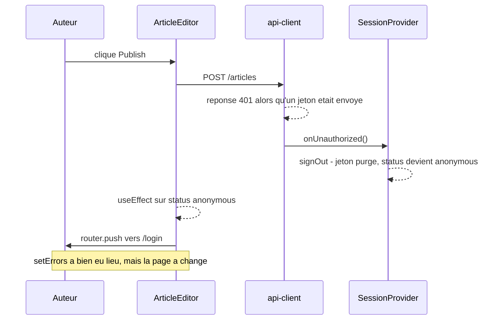
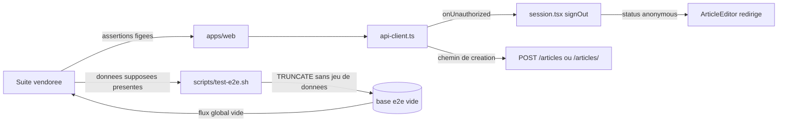

# #12 — Rendre lisibles les erreurs HTTP et les pannes réseau

## 1. Problème

La suite de conformité officielle décrit ce qu'un utilisateur doit voir quand l'API refuse ou ne
répond pas : un message dans `.error-messages`, une coquille de page qui reste celle du template, un
jeton conservé quand la panne ne dit rien de sa validité. Le lot #12 est le plus gros des cinq de
l'epic #11 et ferme cet écart pour le front.

**Le corps de l'issue est cependant périmé, et c'est le premier fait de ce cadrage.** Il annonce
24 échecs sur `error-handling.spec.ts` (19) et `user-fetch-errors.spec.ts` (5). Depuis sa rédaction,
quatre commits ont traité l'essentiel de son contenu : `adca6b9` (REQ-WEB-016/017/018 — mode
indisponible, message de transport unique, coquilles de page), `f51037c` (chargement client de
l'article, du profil et de l'éditeur, ADR 020), `fed7f3a` (bouton de favori de la page article) et
`2310ce8` (page de paramètres lisible quand la session expire). La dernière mesure locale conservée
dans le dépôt (`apps/web/test-results/.last-run.json`, horodatée 2026-08-06 17:20) compte **6 échecs**
sur ces deux fichiers — et elle précède elle-même `fed7f3a` (17:29) et `2310ce8` (17:59).

Le problème réel n'est donc plus « 24 tests rouges » mais **un reliquat court, dont une partie ne se
corrige pas dans `apps/web/src`**, et une ligne de base qu'il faut re-mesurer avant d'écrire quoi que
ce soit.

## 2. Contraintes

- **La suite vendorée ne s'édite jamais**, et sa configuration ne s'assouplit pas non plus
  ([ADR 018](../../../docs/adr/018-conformite-e2e-suite-officielle-vendoree.md), rule 13). Ni
  `timeout`, ni `retries`, ni `expect.timeout` : relever un chiffre est la même triche que retoucher
  une assertion, en moins visible. `pnpm conformance:drift` le vérifie octet pour octet.
- **Les tests e2e sont la cible, pas la preuve.** La preuve reste les tests de couche rattachés aux
  critères par le nommage `describe('REQ-…')` / `it('AC-n: …')` (rule 20, rule 16). Un critère de ce
  dossier qui ne serait vérifiable que par Playwright est mal écrit.
- **Le 401 purge, la panne réseau non** ([ADR 014](../../../docs/adr/014-conformite-au-contrat-de-selecteurs-e2e.md),
  REQ-WEB-002 AC-4, REQ-WEB-016). Ce dossier ne rouvre pas cette décision : il change ce que la
  **page** fait de la purge, jamais le fait qu'elle ait lieu.
- **Le 401 des formulaires d'authentification reste générique** (`email or password is invalid`) :
  l'API refuse volontairement de distinguer email inconnu et mot de passe erroné (REQ-USER-003 AC-3),
  et un message plus précis côté front rouvrirait la fuite d'énumération de comptes que l'API a
  fermée. La propriété ne tient que si les deux bouts la respectent.
- **Le message d'échec de transport est un élément de contrat**, pas un choix de ton :
  `CONNECTION_FAILURE_MESSAGE = 'Unable to connect to the server, please try again'` est asserté
  littéralement par la suite (REQ-WEB-017). Le reformuler casse la suite sans rien casser dans
  l'application.
- **Contrat de sélecteurs** : `.error-messages`, `.article-page`, `.profile-page`, `.user-info`,
  `input[name=…]`, `window.__conduit_debug__` (REQ-WEB-007). Le sélecteur `'.profile-page, .user-info'`
  est évalué en **mode strict** : il échoue dès que les deux existent simultanément. Toute coquille
  de profil ne porte donc qu'une seule des deux classes.
- **Collision de vague 1** : #12 partage `apps/web` avec #13, #14 et #16, et touche l'api-client que
  les trois consomment. Le diff doit rester étroit et éviter les fichiers de leur périmètre
  (`home-page.tsx`, `feed-query.ts`, `SettingsForm.tsx`, `ArticlePreview.tsx`, `CommentSection.tsx`)
  sauf nécessité démontrée.
- Rule 17 (fonctions ≤ 50 lignes, complexité cognitive ≤ 15) et rule 20 (le REQ précède le code).
- Attribution `kamangacode` sur tout artefact produit (rule 03).

## 3. Hors-scope

- **Retoucher la suite vendorée ou `playwright.config.ts`** pour faire passer un test.
- **Rejouer automatiquement une soumission échouée** : aucune clé d'idempotence en écriture dans le
  contrat, un rejeu produirait des doublons (REQ-WEB-017, hors périmètre déclaré).
- **Le rafraîchissement de jeton** : absent du contrat RealWorld (REQ-WEB-002, hors périmètre).
- **La bascule du job CI e2e en gate** : c'est #17, délibérément hors de ce run d'epic (voir
  `graph.md`, rule 21 étape 3).
- **Le flux porté par l'URL et la pagination** (#13), **les paramètres bio/image** (#14), **le favori
  depuis la liste et l'invite à commenter** (#16), **le suivi et le flux personnalisé** (#15).
- **Le préchargement serveur des listes** ([ADR 015](../../../docs/adr/015-prefetch-serveur-et-hydratation-des-listes.md)) :
  voir l'analyse — plusieurs tests amont passent aujourd'hui *sans que leurs mocks ne se déclenchent*.
  C'est un constat, pas un défaut à corriger ici.
- **Réviser les statuts `implemented` de REQ-WEB-016/017/018** autrement que pour rattacher l'issue.

## 4. Analyse technique

### 4.1 Ce que le code fait déjà

Le mécanisme central est en place et il est bon. `api-client.ts` **transporte** l'erreur sans
l'interpréter (`ApiError` porte `status` + `errors`, `toApiError` retombe sur une erreur sans détail
quand le corps est illisible). `lib/errors.ts` en fait la seule traduction (`toMessages`), avec la
table de messages génériques fournie par l'appelant. `session.tsx` distingue quatre états
(`pending` / `anonymous` / `authenticated` / `unavailable`), ne purge que sur un **verdict** 4xx
(`isTokenVerdict`), conserve le jeton sur 5xx, panne de transport et corps illisible, et republie
`window.__conduit_debug__.getAuthState()`. `Navbar` affiche `Connecting…` en mode indisponible.
`ArticlePageNotice` / `ProfilePageNotice` gardent la coquille du template et distinguent « absent »
d'« indisponible ».

Autrement dit : **la moitié « rendre lisible » de l'issue est faite**. Ce qui reste tient à trois
coutures précises.

### 4.2 Couture 1 — la purge de session éjecte la page avant que le message soit lisible

Le chemin est mécanique et se lit en trois sauts :

`ArticleEditor` redirige sur `status === 'anonymous'` sans distinguer **arriver anonyme** de
**le devenir en cours d'édition**. `SettingsPage` avait exactement le même défaut ; `2310ce8` l'a
fermé en gardant une copie locale du dernier compte résolu (`account`) et en restreignant la
redirection à `status === 'anonymous' && !account`. La règle existe donc, écrite une fois, dans un
seul fichier — et l'éditeur ne la porte pas.

Deux tests amont en dépendent : *401 when submitting settings form* (probablement vert depuis
`2310ce8`, à confirmer) et, indirectement, *400 on article creation* dès que la couture 2 est traitée.

### 4.3 Couture 2 — le chemin de création d'article, et le conflit apparent entre deux tests amont

Deux tests amont visent la création, avec **deux URL différentes** :

| Test | Route posée | Effet attendu |
|---|---|---|
| `should handle 400 on article creation` (l. 68) | `https://api.realworld.show/api/articles` | POST intercepté, réponse 400 |
| `should show error message on create article form when network fails` (l. 622) | `https://api.realworld.show/api/articles/` | requête avortée (panne de transport) |

Playwright compile un motif de chaîne en **regex ancrée** (`globToRegexPattern` produit un motif
`^…`, et un motif sans `*` est d'abord résolu tel quel par `new URL()`). La barre finale est donc
significative : un `page.route('…/articles/')` n'intercepte pas un `POST …/articles`.

Conséquence observée dans les artefacts du dernier run : l'abort ne se déclenche jamais, la requête
part vers l'API réelle (relayée par le terminateur TLS de l'[ADR 019](../../../docs/adr/019-alignement-de-l-hote-d-api-pour-la-suite-e2e.md)),
le jeton factice `fake-token-for-testing` récolte un 401, la session se purge et l'éditeur redirige.
La capture d'échec montre exactement cela : **la page de connexion**, et aucun `.error-messages`.

Les deux tests ne sont contradictoires qu'en apparence. Ils sont simultanément satisfaisables si —
et seulement si — les deux changements sont faits **ensemble** :

- le client émet `/articles/` (le test « réseau » intercepte, l'abort produit le message de
  transport) ;
- **et** un 401 sur une soumission ne fait plus disparaître l'éditeur (le test « 400 », dont le mock
  ne matche alors plus, reçoit un vrai 401 de l'API et doit malgré tout afficher `.error-messages`
  sur un formulaire toujours monté).

Traiter la couture 2 sans la couture 1 **régresse** un test qui passe aujourd'hui. C'est la
dépendance d'ordre la plus importante du lot.

> Aligner un chemin d'API sur la forme qu'un contrat externe intercepte est une décision, pas un
> détail d'implémentation : elle demande un **ADR** (prochain numéro libre : `021`).

### 4.4 Couture 3 — un test que le front ne peut pas satisfaire

`user-fetch-errors.spec.ts`, *should handle 401 Unauthorized on /api/user*, assert après la purge que
`.article-preview` est visible sur l'accueil.

Le flux global **n'est pas mocké** dans ce test : il part vers l'API réelle du run. Or
`scripts/test-e2e.sh` fait un `TRUNCATE` complet avant de démarrer, et ce fichier de specs ne crée
aucun article. La page affiche donc, très correctement, « No articles are here... yet. » — ce que la
capture d'échec confirme.

Aucune modification de `apps/web/src` ne rend ce test vert. Il suppose une API **peuplée**, ce
qu'elle est en amont (démo publique) et ce que notre harnais défait volontairement. La correction
appartient au harnais : un jeu de données minimal, créé **par l'API**, entre la purge et le run.
Ce n'est pas assouplir la suite — les assertions ne bougent pas, seul l'environnement qu'elles
supposent est fourni.

Le laisser dépendre des articles créés par les autres fichiers de specs serait pire : la suite est
parallélisée, l'ordre n'est pas garanti, et le test deviendrait vert ou rouge selon la charge de la
machine.

### 4.5 Un angle mort à nommer, sans le corriger ici

Plusieurs tests d'`error-handling.spec.ts` mockent `…/articles*` puis assertent seulement que la
navbar et la bannière sont visibles (500 sur le flux, JSON malformé, corps vide, 500 intermittent).
La page d'accueil précharge sa liste **côté serveur** (ADR 015) et `staleTime: 30_000` empêche un
refetch immédiat après hydratation : ces `page.route()` ne se déclenchent donc jamais, et le test
passe sans avoir éprouvé le chemin d'erreur qu'il décrit.

C'est un vert honnête (le contrat est satisfait) mais **creux**. Le noter ici évite qu'un futur
lecteur en tire une confiance qu'il n'a pas, et évite surtout la tentation inverse : déplacer le
chargement du flux vers le navigateur *pour rendre ces tests moins vacants* serait défaire l'ADR 015
au bénéfice d'une métrique.

### 4.6 Data-flow des trois coutures

Lignes : la transition qui échoue. Colonnes : la surface qui doit en rendre compte.

### Matrice des effets observables

| Transition | Formulaire (auth, paramètres, éditeur, commentaire) | Page de contenu (article, profil) | Session (navbar, jeton) |
|---|---|---|---|
| 400 / 422 à la soumission | `.error-messages` porte les messages par champ du contrat §10 ; la saisie est conservée | N/A | N/A |
| 401 à la soumission, session ouverte | `.error-messages` porte le message de session expirée **et le formulaire reste monté** (manque actuel sur l'éditeur) | N/A | Le jeton est purgé, la navbar repasse anonyme (inchangé) |
| 401 à la soumission d'un formulaire d'authentification | Message **générique** unique, sans distinguer email inconnu et mot de passe erroné | N/A | Aucune purge : aucun jeton n'avait été envoyé |
| 403 à la soumission | `.error-messages` visible, l'action reste sans effet local (favori, suivi, suppression) | N/A | N/A |
| 404 sur une ressource | N/A | Coquille du template avec message d'**absence** (`.article-page` / `.profile-page` seule) | N/A |
| 5xx en lecture | N/A | Coquille du template avec message d'**indisponibilité**, distinct de l'absence | Mode indisponible, jeton conservé, `Connecting…` |
| Panne de transport (aucune réponse) | `.error-messages` porte le message de transport unique, formulaire réutilisable | Coquille d'indisponibilité | Mode indisponible, jeton conservé |
| 200 au corps illisible (JSON malformé, corps vide) | Message de transport (rien d'exploitable n'est revenu) | Coquille d'indisponibilité | Mode indisponible, jeton **conservé** — ce n'est pas un verdict sur le jeton |

## 5. Critères d'acceptation (binaires)

> Trois REQ sont concernés : **REQ-WEB-019** (nouveau), **REQ-WEB-008** (amendé, prochain AC libre :
> AC-8), **REQ-CONF-003** (nouveau). REQ-WEB-016/017/018 sont déjà `implemented` et couverts ; ce lot
> ne fait que rattacher l'issue dans leur `related.issues` et re-prouver leur portion e2e.

### REQ-WEB-019 — Une session purgée en cours d'édition ne fait pas disparaître le formulaire

- [ ] **REQ-WEB-019 / AC-1** — Given un utilisateur authentifié sur `/editor` avec une saisie en
      cours, When l'enregistrement revient en 401 et que la session est purgée, Then l'éditeur reste
      monté (aucune redirection déclenchée) et `.error-messages` porte le message de session expirée.
- [ ] **REQ-WEB-019 / AC-2** — Given un visiteur qui arrive sur `/editor` sans jeton, When la session
      se résout en `anonymous` alors qu'aucun compte n'a été résolu sur cette page, Then il est
      redirigé vers `/login` — le comportement existant (REQ-WEB-014 AC-6) est préservé.
- [ ] **REQ-WEB-019 / AC-3** — Given `/editor/:slug` dont l'article est chargé puis modifié, When un
      401 purge la session à l'enregistrement, Then les champs portent toujours les valeurs **saisies**
      et non celles de l'article d'origine.
- [ ] **REQ-WEB-019 / AC-4** — Given la page de paramètres et l'éditeur, When tous deux subissent une
      purge de session en cours d'édition, Then ils appliquent la règle depuis une **source unique** :
      aucune des deux pages ne porte sa propre copie de la condition de redirection.
- [ ] **REQ-WEB-019 / AC-5** — Given une session purgée en cours d'édition, When l'utilisateur
      consulte la barre de navigation, Then celle-ci est redevenue anonyme — la page conserve son
      formulaire sans prétendre que la session est encore ouverte.

### REQ-WEB-008 (amendement) — Chemin de création d'article

- [ ] **REQ-WEB-008 / AC-8** — Given une création d'article, When le client construit la requête,
      Then le chemin émis est celui que le contrat externe intercepte, écrit **une seule fois** dans
      `api-client.ts`, et le chemin de modification d'article reste inchangé.

### REQ-CONF-003 — Le harnais e2e fournit le jeu de données minimal que la suite suppose

- [ ] **REQ-CONF-003 / AC-1** — Given une base e2e vidée par le harnais, When la suite démarre,
      Then au moins un article publié existe, de sorte qu'un test lisant le flux global sans le mocker
      trouve un `.article-preview`.
- [ ] **REQ-CONF-003 / AC-2** — Given ce jeu de données, When il est créé, Then il l'est **par
      l'API** — le harnais du front n'ouvre aucune connexion directe à la base pour écrire — et il est
      idempotent : deux exécutions successives ne produisent ni doublon ni échec.
- [ ] **REQ-CONF-003 / AC-3** — Given un run où la création du jeu de données échoue, When le harnais
      poursuit, Then il sort en code non nul avant d'exécuter la suite, plutôt que de laisser
      l'absence de données passer pour un défaut du front.
- [ ] **REQ-CONF-003 / AC-4** — Given la suite exécutée deux fois d'affilée sur la même base, When on
      compare les deux verdicts, Then le test qui lit le flux global sans mock rend le même résultat —
      il ne dépend d'aucun article créé par un autre fichier de specs.

### Conditions de sortie (contrôles, pas des critères)

- [ ] `pnpm conformance:drift` reste vert : aucun octet de la suite vendorée ni de ses helpers n'a
      bougé, et `playwright.config.ts` n'étend rien de plus qu'avant.
- [ ] `pnpm requirements:validate`, `pnpm lint`, `pnpm typecheck`, `pnpm test` verts.
- [ ] Le nombre d'échecs sur `error-handling.spec.ts` + `user-fetch-errors.spec.ts` est **strictement
      inférieur** à celui mesuré en slice 1, et aucun test vert en slice 1 n'est devenu rouge.

## 6. Breadboard

**Places** (écrans et surfaces touchés)

- `/editor` et `/editor/:slug` — les seules pages qui changent de comportement.
- `/settings` — inchangée fonctionnellement ; sa règle est **extraite**, pas modifiée.
- Le harnais `scripts/test-e2e.sh` — une étape de plus, entre la purge et le build.

**Affordances**

- Après un 401 en cours d'édition : le formulaire reste, le message apparaît, le bouton redevient
  actionnable, la navbar redevient anonyme. L'utilisateur peut copier sa saisie, se reconnecter dans
  un autre onglet, ou recharger — rien n'est perdu sans qu'il l'ait vu.

**Coutures** (les points de connexion, dans l'ordre où le Build les rencontre)

| # | Couture | Fichier | Nature du geste |
|---|---|---|---|
| C1 | Mémoire du dernier compte résolu sur une page authentifiée | `apps/web/src/lib/session.tsx` (ou un module voisin dédié) | **Extraire** de `app/settings/page.tsx` un hook rendant le compte retenu et la décision de rediriger |
| C2 | Redirection de l'éditeur | `apps/web/src/components/ArticleEditor.tsx` | Remplacer la condition `status === 'anonymous'` par la sortie de C1 |
| C3 | Chemin de création | `apps/web/src/lib/api-client.ts`, `articleEndpoints` | Une constante de chemin, un ADR 021 qui dit pourquoi |
| C4 | Jeu de données minimal | `scripts/test-e2e.sh` | Étape après le `TRUNCATE`, avant le build ; création via l'API du run |
| C5 | Traçabilité | `docs/requirements/functional/web/REQ-WEB-019.md`, `.../REQ-WEB-008.md`, `docs/requirements/non-functional/conformance/REQ-CONF-003.md` | REQ écrits **avant** le code (rule 20) |

**Entrées / sorties**

- Entrée : `status` de session + présence d'un compte déjà résolu sur la page. Sortie : rediriger, ou
  rester avec le message.
- Entrée : `DATABASE_URL` et l'URL d'API du run. Sortie : au moins un article publié, ou un code de
  sortie non nul.

**Ce que le Build ne doit pas toucher**

`SettingsForm.tsx`, `CommentSection.tsx`, `ArticlePreview.tsx`, `home-page.tsx`, `feed-query.ts` —
périmètres de #13, #14 et #16 dans la même vague.

## 7. Slices

1. **Slice 1 — Re-mesurer la ligne de base (aucun code).**
   `bash scripts/test-e2e.sh error-handling.spec.ts user-fetch-errors.spec.ts` sur `staging` à jour.
   Consigner l'inventaire nominatif des échecs en annexe de ce dossier. **Gate implicite** : si
   l'inventaire contredit l'analyse §4, le dossier est révisé avant la slice 2. Cette slice existe
   parce que la seule mesure disponible précède trois commits correctifs — partir de son chiffre
   serait travailler sur un fantôme.

2. **Slice 2 — Jeu de données minimal du harnais (REQ-CONF-003).**
   Indépendante des autres, aucun fichier de `apps/web/src`, donc **zéro collision** avec le reste de
   la vague 1. Ferme le seul test que le front ne peut pas satisfaire. Livrable cohérent seul :
   REQ-CONF-003 + l'étape de `test-e2e.sh` + un test de couche sur son idempotence si sa logique
   dépasse trois lignes.

3. **Slice 3 — Le formulaire survit à la purge (REQ-WEB-019).**
   Extraire la règle de `app/settings/page.tsx` (C1), l'appliquer à `ArticleEditor` (C2). Tests RTL
   colocalisés, un `it('AC-n: …')` par critère. Livrable cohérent seul : la page de paramètres garde
   son comportement, l'éditeur gagne le sien.

4. **Slice 4 — Chemin de création aligné (REQ-WEB-008 AC-8) + ADR 021.**
   **Dépend de la slice 3** : sans elle, ce changement fait régresser *400 on article creation*.
   L'ADR documente pourquoi un chemin d'API prend la forme qu'un contrat externe intercepte, et ce
   que ça coûte (une asymétrie création/modification à expliquer, sinon un lecteur la « corrigera »
   par propreté).

5. **Slice 5 — Re-mesure, écart, leçon.**
   Re-run des deux fichiers, comparaison à la slice 1, rattachement de l'issue 12 dans
   `related.issues` de REQ-WEB-016/017/018, et une entrée dans `artifacts/lessons.md` sur l'écart
   entre l'inventaire d'une issue et l'état réel du dépôt au moment de la prendre — c'est le fait le
   plus réutilisable de ce lot.

Les slices 2 et 3 sont **parallélisables** (aucun fichier commun). La slice 4 suit la 3. La slice 1
précède tout, la slice 5 clôt.

---

## Annexe — Mesure conservée (2026-08-06 17:20, périmée)

Source : `apps/web/test-results/` et son `.last-run.json`. **Antérieure à `fed7f3a` et `2310ce8`.**

| Test | Symptôme relevé | Lecture au 2026-08-06 (HEAD `2310ce8`) |
|---|---|---|
| `error-handling` › 401 when submitting settings form | Redirigé vers `/login`, pas de `.error-messages` | Probablement fermé par `2310ce8` — à confirmer slice 1 |
| `error-handling` › network error when favoriting article | `button:has-text("Favorite Article")` introuvable | Probablement fermé par `fed7f3a` — à confirmer slice 1 |
| `error-handling` › 500 on user profile load | `'.profile-page, .user-info'` → 2 éléments (mode strict) | Probablement fermé par `f51037c` (coquille d'attente à une seule classe) — à confirmer |
| `error-handling` › network error on user profile load | idem | idem |
| `error-handling` › create article form when network fails | Redirigé vers `/login`, pas de `.error-messages` | **Ouvert** — coutures 1 + 2 (§4.2, §4.3) |
| `user-fetch-errors` › 401 Unauthorized on /api/user | `.article-preview` introuvable (flux vide) | **Ouvert** — couture 3 (§4.4), hors `apps/web/src` |

Ce cadrage n'a **pas** exécuté la suite : le harnais démarre Docker, purge une base et compile deux
applications, ce qui sort du périmètre lecture seule de la passe Shape. C'est précisément l'objet de
la slice 1.

*Le scan de zones d'ombre (`shadow`) n'a pas été exécuté dans cette passe : à lancer par
l'orchestrateur avant le gate Shape.*
