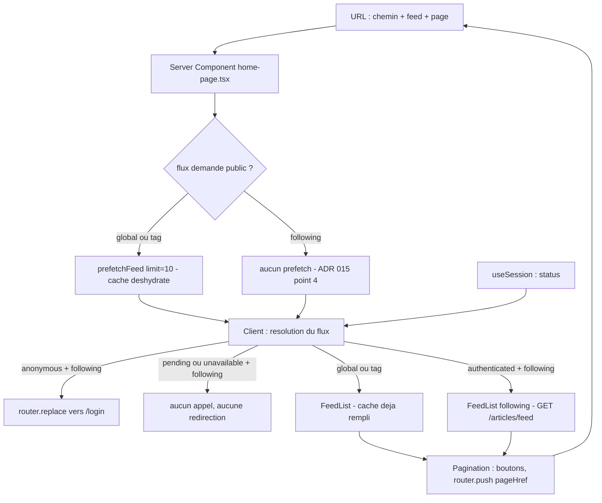
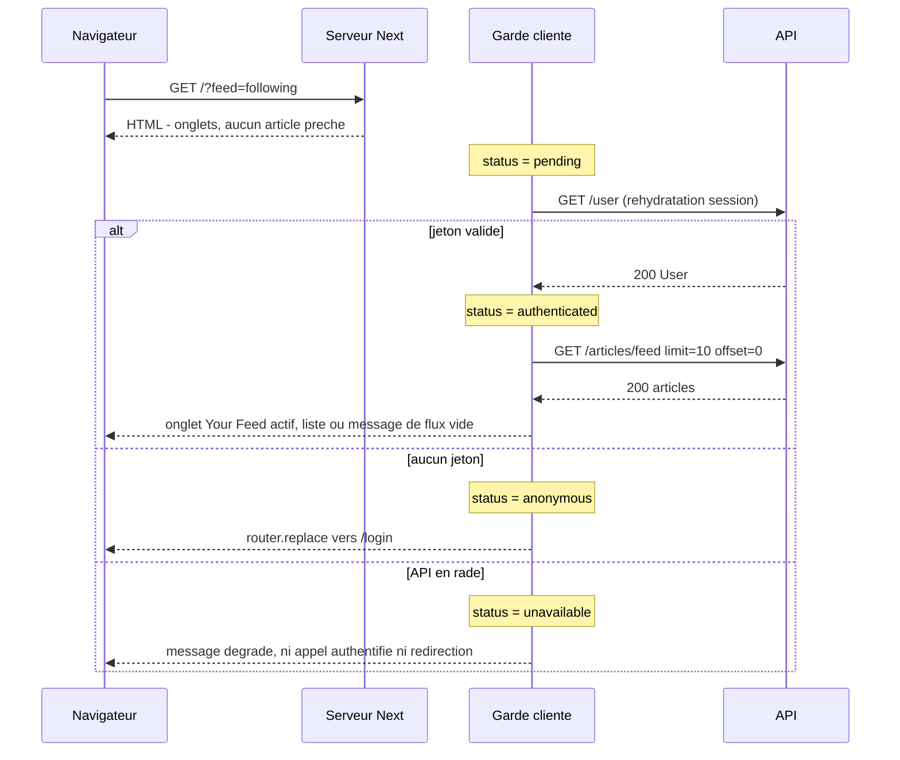

# Porter le flux et la page dans l'URL

## 1. Problème

Le flux affiché et la page courante ne sont pas entièrement portés par l'URL : `/?feed=following`
retombe sur le flux global quel que soit le lecteur, les contrôles de pagination ne sont pas les
éléments que le contrat vise, et la taille de page du front est celle de l'API (20) alors que le
contrat en attend 10. Pour le lecteur : une page de liste n'est pas partageable, un accès direct à
`?page=3` ne montre pas la page 3, et le flux personnel n'est atteignable que par un clic. Onze
tests de la suite vendorée le constatent (lot 2/5 de #11), et le flux personnel de #15 est bloqué
derrière ce lot.

## 2. Contraintes

- **La suite vendorée ne s'édite jamais** ([ADR 018](../../../docs/adr/018-conformite-e2e-suite-officielle-vendoree.md),
  rule 13). Ni les assertions, ni `playwright.config.ts`. Une assertion rouge est un défaut du front.
- **Cycle req-driven** (rule 20) : les REQ s'écrivent avant le code, les tests par couche échouent
  avant d'implémenter. La suite e2e est la **cible**, jamais la preuve — la preuve reste nos tests
  de couche rattachés aux critères.
- **La session ne quitte pas le navigateur** ([ADR 012](../../../docs/adr/012-rendu-hybride-et-session-client.md)) :
  ni cookie, ni session serveur. Le rendu serveur **ne peut pas** savoir si le lecteur est connecté.
  Aucun middleware Next ne peut donc arbitrer `/?feed=following` — la garde est forcément cliente.
- **Le préchargement serveur des listes publiques reste en place**
  ([ADR 015](../../../docs/adr/015-prefetch-serveur-et-hydratation-des-listes.md), confirmé par
  l'[ADR 020](../../../docs/adr/020-chargement-client-des-pages-de-contenu.md) qui l'exclut
  explicitement de son recul). `/` et `/tag/:tag` gardent HTML complet + cache hydraté.
- **Le flux personnel n'est jamais préchargé** (ADR 015, décision §4) : le serveur est anonyme, un
  préchargement ne pourrait que renvoyer 401 ou, pire, le flux d'un autre.
- **Un seul chemin de données par écran** : `/` et `/tag/:tag` partagent `home-page.tsx` ; la clé de
  cache et la fonction de chargement vivent une seule fois dans `lib/feed-query.ts`. Aucune des
  modifications ci-dessous ne doit rouvrir la dérive parallèle que l'ADR 015 a fermée.
- **Markup RealWorld** (rule 11) : `.feed-toggle`, `.nav-link`, `.pagination`, `.page-item`,
  `.empty-feed-message`, `.article-preview`. Tout écart au gabarit se justifie en commentaire.
- **Ne pas casser** : `auth.spec.ts` (vert en entier), `xss-security.spec.ts`, `health.spec.ts`, la
  publication d'article et le dépôt de commentaire. Les tests de couche du front et la couverture AC
  restent verts.

## 3. Hors-scope

- Le suivi d'un autre compte et le contenu réel du flux personnel : c'est #15, qui dépend de ce lot
  mais ne s'y traite pas.
- Les erreurs HTTP et pannes réseau lisibles : c'est #12, qui touche l'api-client et les formulaires.
- La bascule du job CI e2e en gate : c'est #17, délibérément hors du run (graphe de l'epic).
- Les onglets du profil (`/profile/:username`, `/favorites`) : ils paginent déjà par l'URL et aucun
  test du lot ne les vise. Ils héritent néanmoins du changement de contrôle de pagination — vérifier
  la non-régression, pas étendre le périmètre.
- Le choix de la taille de page par l'utilisateur, le défilement infini (hors contrat RealWorld).
- Toute retouche à `apps/api` : la taille de page se règle côté appelant, l'API accepte déjà `limit`.

## 4. Analyse technique

### 4.1 Trois défauts indépendants, pas un seul

Le titre de l'issue suggère un défaut unique (« l'état vit dans React »). L'exploration du code en
montre **trois**, de causes disjointes, qui expliquent chacun un sous-ensemble des onze échecs. Les
traiter comme un seul produirait un correctif qui n'en ferait passer qu'un tiers.

**Défaut A — la taille de page du front est celle de l'API.**
`fetchFeed` n'envoie jamais `limit` (`apps/web/src/lib/feed-query.ts:84`), donc l'API applique son
défaut `DEFAULT_PAGE_LIMIT = 20` (`packages/shared/src/model/pagination.ts:4`), et
`pageCount`/`offsetForPage` calculent sur cette même valeur. Le contrat en attend **10** : la suite
crée 15 articles et affirme deux pages, 10 puis 5 (`url-navigation.spec.ts:127,252,266`), et
`navigation.spec.ts:160` crée 12 articles et exige `count() <= 10`. Avec 20, il n'y a jamais de
seconde page : **toutes** les assertions de pagination tombent, y compris celles qui portent en
apparence sur l'URL. C'est le défaut à corriger en premier, parce qu'il masque les deux autres.

La conséquence documentaire n'est pas neutre : REQ-WEB-010 pose comme règle que « la taille de page
vient de `@repo/shared` (`DEFAULT_PAGE_LIMIT`), pas d'une constante locale ». Cette règle protégeait
d'un désalignement entre le calcul du front et la découpe de l'API. La protection se conserve à
condition que le front **envoie** sa taille (`limit=10`) au lieu de laisser l'API choisir : c'est
l'envoi explicite, et non le partage de la constante, qui garantit que les deux découpent pareil.
La règle du REQ doit donc être réécrite, pas contournée en silence.

**Défaut B — les contrôles de pagination ne sont pas des boutons.**
`Pagination.tsx` rend `<li class="page-item"><a class="page-link" href=…>`. La suite cible
`.pagination button:has-text("2")` (six occurrences) et
`.pagination .page-item:has(button:has-text("2"))`. Un `<a>` ne satisfait aucun de ces deux
sélecteurs. `SELECTORS.md` décrit d'ailleurs `.page-item` comme *« Individual page **button**
wrapper »* : la suite et le contrat s'accordent, c'est notre markup qui diverge.

Imbriquer un `<button>` dans le `<a>` est exclu (contenu interactif imbriqué, HTML invalide). Le
contrôle devient donc un `<button>` piloté par `useRouter().push(...)`, et `Pagination` passe de
Server Component à Client Component. Le prix est réel et se nomme : plus d'ouverture dans un nouvel
onglet, plus de lien de pagination explorable. L'arithmétique reste dans `lib/pagination.ts` et
`pageHref` reste le point unique qui fabrique la cible — seule la façon de l'emprunter change.

**Défaut C — le flux demandé et le flux résolu sont confondus.**
`home-page.tsx:35` appelle `resolveFeed({ tag, feedParam, isAuthenticated: false })`. Le `false` est
correct côté serveur (ADR 012 : il ne sait pas), mais son résultat — `{ kind: 'global' }` — est
ensuite traité comme le flux **final** : il est préchargé, passé à `FeedToggle` (qui marque donc
« Global Feed » actif) et à `FeedList`. Sur `/?feed=following`, un lecteur connecté voit le flux
global avec le mauvais onglet actif, et un visiteur anonyme n'est jamais renvoyé vers `/login`.

Il manque une distinction : le **flux demandé** vient de l'URL et est connu du serveur ; le **flux
résolu** dépend de la session et n'est connu qu'après montage. Le serveur ne peut résoudre que les
flux publics (global, tag) ; il précharge ceux-là et **s'abstient** sur `following`, exactement ce
que l'ADR 015 §4 prescrit déjà. Un composant client reçoit le flux demandé, lit `status`, et tranche.

Le point qu'une implémentation plausible rate : la garde ne peut pas s'écrire sur `user === null`.
`session.tsx` distingue quatre états, et trois d'entre eux ont `user === null`. Rediriger sur
`user === null` éjecterait les lecteurs connectés pendant la fenêtre de réhydratation — le défaut
déjà payé une fois sur `/settings`, dont le commentaire porte encore la trace. La garde s'écrit sur
`status === 'anonymous'`, et **seulement** sur lui.

Le corollaire est aussi contraignant : tant que `status` n'est pas `authenticated`, la liste du flux
personnel ne doit **pas** être montée. `api-client` injecte le jeton depuis la session ; monter
`FeedList` avec `feed=following` alors que le jeton est encore `null` émettrait un
`GET /articles/feed` anonyme, qui reviendrait en 401 et afficherait un échec là où le lecteur
attend sa liste.

Le quatrième état, `unavailable` (jeton conservé, API invérifiable — REQ-WEB-016), ne redirige pas :
un lecteur dont l'API est en rade n'est pas un anonyme, et l'envoyer au formulaire de connexion lui
ferait tenter une action qui échouera aussi.

### 4.2 Chemin de données après correction

La boucle se referme sur l'URL : c'est ce qui rend la page partageable et le bouton précédent
prévisible. Aucune page n'est plus stockée dans un état React.

### 4.3 Séquence du cas qui décide de tout

Deux allers-retours séquentiels avant que la liste n'apparaisse (session puis flux). La suite
accorde 2 s à `.empty-feed-message` sur ce trajet (`url-navigation.spec.ts:95`) : le budget tient en
local et en CI sur une API de test, mais c'est le point de fragilité temporelle du lot, et il faut
le savoir avant d'accuser une instabilité.

### 4.4 Seams identifiés

| Fichier | Rôle actuel | Ce qui change |
|---|---|---|
| `apps/web/src/lib/pagination.ts` | arithmétique pure, `DEFAULT_PAGE_LIMIT` par défaut | taille de page du front (10) posée et exportée ici, utilisée par défaut |
| `apps/web/src/lib/feed-query.ts` | clé de cache, `fetchFeed`, `resolveFeed` | `fetchFeed` envoie `limit` ; `resolveFeed` sépare demandé et résolu |
| `apps/web/src/app/home-page.tsx` | résout le flux et précharge | précharge **seulement** un flux public, transmet le flux **demandé** |
| `apps/web/src/components/FeedToggle.tsx` | onglets, déjà client | reçoit le flux résolu ; l'onglet actif suit l'URL, jamais la session |
| `apps/web/src/components/FeedList.tsx` | liste + états vide/erreur | message d'absence distinct pour le flux personnel |
| `apps/web/src/components/Pagination.tsx` | Server Component, liens | Client Component, boutons, `router.push` |
| *nouveau* composant de garde/résolution | — | lit `status`, redirige, retient la liste jusqu'à résolution |

`Pagination` n'est monté que par `FeedList`, lui-même déjà client : le passage en client ne contamine
aucun autre arbre. `ProfileView` en hérite par ce seul chemin — c'est la surface de non-régression à
vérifier, pas une seconde implémentation à écrire.

Lignes : transitions. Colonnes : état de la session au moment de la transition.

### Matrice des effets observables

| Transition | `anonymous` | `authenticated` | `pending` | `unavailable` |
|---|---|---|---|---|
| Arrivée directe sur `/` | Global Feed actif, liste préchargée | Global Feed actif (l'URL décide), onglet Your Feed proposé | liste préchargée affichée, onglets anonymes transitoires | liste préchargée affichée, onglets anonymes |
| Arrivée directe sur `/?feed=following` | `router.replace('/login')`, aucun appel authentifié | Your Feed actif, `GET /articles/feed` | aucune redirection, aucun appel, onglets seuls | ni redirection ni appel authentifié — message dégradé |
| Arrivée directe sur `/tag/:tag` | onglet du tag actif, liste préchargée | idem + onglet Your Feed proposé | idem anonyme | idem anonyme |
| Arrivée directe sur `?page=N` | page N affichée, `.page-item` N actif | idem | liste préchargée de la page N | idem |
| Clic « Your Feed » | N/A (onglet non rendu à un anonyme) | navigation vers `/?feed=following` | N/A (onglet non rendu tant que non résolu) | N/A (onglet non rendu) |
| Clic « Global Feed » | navigation vers `/` exactement, page remise à 1 | idem | N/A (onglets anonymes : le lien est le même) | idem anonyme |
| Clic bouton de page N | URL `<chemin>?page=N`, filtres conservés | idem | N/A (pagination rendue seulement avec une liste chargée) | N/A |
| Retour navigateur après changement de page | page précédente restaurée depuis l'URL | idem | N/A | N/A |
| Flux personnel vide | N/A (redirigé avant le chargement) | `.empty-feed-message` = « Your feed is empty » + `a[href="/"]` | N/A (pas encore chargé) | N/A (pas chargé) |
| Flux public vide | message d'absence générique | idem | N/A (préchargé, donc jamais en attente) | idem anonyme |

## 5. Critères d'acceptation (binaires)

REQ-WEB-009 et REQ-WEB-010 existent et sont `implemented`. Ils sont **amendés** (rule 20 :
comportement existant étendu), pas dupliqués : AC-2 et AC-3 de REQ-WEB-009 sont réécrits — le repli
silencieux vers le flux global qu'ils prescrivent est précisément ce que le contrat refuse — et les
nouveaux critères prennent la suite des numéros existants, sans jamais réutiliser un id.

### REQ-WEB-009 — page d'accueil et onglets de flux

- [ ] **REQ-WEB-009 / AC-2** *(amendé)* — Given un lecteur connecté sur `/`, When la page s'affiche,
      Then l'onglet « Your Feed » apparaît en plus de « Global Feed » et c'est « Global Feed » qui
      porte la classe `active` — l'onglet actif est désigné par l'URL, jamais par la session.
- [ ] **REQ-WEB-009 / AC-3** *(amendé)* — Given un visiteur anonyme, When il ouvre
      `/?feed=following`, Then le navigateur se retrouve sur `/login` et aucune requête
      `GET /articles/feed` n'a été émise.
- [ ] **REQ-WEB-009 / AC-7** — Given un lecteur connecté, When il ouvre `/?feed=following`
      directement, Then l'onglet « Your Feed » porte la classe `active` et la liste provient de
      `GET /articles/feed`, jamais d'un filtre de `GET /articles`.
- [ ] **REQ-WEB-009 / AC-8** — Given un lecteur connecté dont le flux personnel ne renvoie aucun
      article, When la liste est chargée, Then `.empty-feed-message` contient « Your feed is empty »
      et contient un lien `a[href="/"]`.
- [ ] **REQ-WEB-009 / AC-9** — Given un flux **public** (global ou tag) sans article, When la liste
      est chargée, Then `.empty-feed-message` rend le message d'absence générique et ne mentionne
      pas de flux personnel.
- [ ] **REQ-WEB-009 / AC-10** — Given une session dans l'état `pending` sur `/?feed=following`, When
      le premier rendu a lieu, Then aucune redirection n'est déclenchée et aucune requête
      authentifiée n'est émise.
- [ ] **REQ-WEB-009 / AC-11** — Given une session dans l'état `unavailable` sur `/?feed=following`,
      When la page se rend, Then le lecteur n'est pas redirigé vers `/login` et aucun appel
      authentifié n'est émis.
- [ ] **REQ-WEB-009 / AC-12** — Given un lecteur connecté sur `/`, When il active l'onglet
      « Your Feed », Then l'URL devient exactement `/?feed=following` ; et depuis `/?feed=following`,
      activer « Global Feed » ramène à `/` exactement.

### REQ-WEB-010 — pagination

- [ ] **REQ-WEB-010 / AC-7** — Given une liste dont le total dépasse une page, When la pagination est
      rendue, Then chaque `.page-item` contient un élément `button` portant le numéro de page, et
      aucun lien interactif de pagination n'est rendu.
- [ ] **REQ-WEB-010 / AC-8** — Given la page 1 d'une liste paginée sous `/tag/:tag`, When le lecteur
      active le bouton « 2 », Then l'URL devient `/tag/:tag?page=2` et le `.page-item` du 2 porte la
      classe `active`.
- [ ] **REQ-WEB-010 / AC-9** — Given l'URL `/tag/:tag?page=2` ouverte directement, When la liste est
      chargée, Then les articles de la deuxième page s'affichent et le `.page-item` du 2 porte la
      classe `active`.
- [ ] **REQ-WEB-010 / AC-10** — Given une taille de page front de 10 et un total de 15 articles, When
      les deux pages sont rendues, Then la première contient 10 `.article-preview` et la seconde 5,
      et la requête envoyée à l'API porte `limit=10`.
- [ ] **REQ-WEB-010 / AC-11** — Given un lecteur sur `/?feed=following&page=2`, When il active
      « Global Feed », Then l'URL devient `/` exactement — la page repart à 1 plutôt que d'être
      reportée.
- [ ] **REQ-WEB-010 / AC-12** — Given une liste paginée sur `/?feed=following`, When le lecteur
      change de page, Then l'URL devient `/?feed=following&page=2` — le filtre de flux précède le
      paramètre de page et n'est pas perdu.

### Critères de non-régression (vérifiés, pas écrits en REQ)

- [ ] `auth.spec.ts`, `xss-security.spec.ts` et `health.spec.ts` restent verts.
- [ ] Les onglets du profil (`/profile/:username`, `/favorites`) paginent toujours, avec le nouveau
      contrôle.
- [ ] `pnpm requirements:validate` passe : chaque fichier cité dans `implementation` existe.
- [ ] `pnpm conformance:drift` reste vert (aucune retouche à la suite vendorée).

## 6. Breadboard

**Places** (ce qu'on atteint par une URL) :

- `/` — flux global, page 1
- `/?page=N` — flux global, page N
- `/?feed=following` — flux personnel (connecté) · `/login` (anonyme)
- `/?feed=following&page=N` — flux personnel paginé
- `/tag/:tag` et `/tag/:tag?page=N` — flux d'un tag
- `/login` — destination de la garde

**Affordances** (ce qu'on actionne) :

- onglet « Your Feed » → `href="/?feed=following"` (rendu au seul lecteur connecté)
- onglet « Global Feed » → `href="/"` (remet la page à 1 par construction : la cible ne porte pas de
  paramètre `page`)
- onglet du tag → `href="/tag/:tag"`
- bouton de page N → `router.push(pageHref(pathname, searchParams, N))`
- lien « Global Feed » du message de flux personnel vide → `href="/"`

**Interfaces entre les pièces** :

| Frontière | Entrée | Sortie |
|---|---|---|
| URL → serveur | chemin, `feed`, `page` | flux **demandé** + numéro de page |
| Serveur → client | flux demandé, page, cache déshydraté (public seulement) | props |
| Session → garde | `status` (`pending` / `anonymous` / `authenticated` / `unavailable`) | flux **résolu**, ou redirection, ou attente |
| Garde → `FeedToggle` | flux résolu | onglet actif |
| Garde → `FeedList` | flux résolu + page | clé de cache `['articles', feed, page]` |
| `FeedList` → `Pagination` | `articlesCount`, page courante, `pathname`, `searchParams` | boutons |
| `Pagination` → URL | `pageHref` | navigation cliente |

Le point de connexion à ne pas rater : **la clé de cache doit rester identique** entre le
préchargement serveur et le `useQuery` client pour les flux publics. Le flux passé à `feedQueryKey`
côté serveur (flux demandé, résolu comme public) et côté client (flux résolu) doit produire la même
clé, sans quoi le préchargement devient un cache manqué et la page émet une requête au chargement —
symptôme silencieux que rien ne signale.

## 7. Slices

1. **Slice 1 — Le cadre écrit, aucun code.** ADR 022 (flux demandé vs flux résolu, garde cliente sur
   `/?feed=following`, pourquoi aucun middleware ne peut le faire) et ADR 023 (contrôles de
   pagination en `button` et taille de page du front à 10). Numéros arbitrés à la porte Shape :
   #12 prend 021 (numéro d'issue le plus bas), ce lot prend 022 et 023. Amendements de REQ-WEB-009 (AC-2 et AC-3
   réécrits, AC-7 à AC-12 ajoutés) et REQ-WEB-010 (règle de taille de page réécrite, AC-7 à AC-12
   ajoutés), `related.issues` complété avec 13. `pnpm requirements:validate` vert.

2. **Slice 2 — Taille de page du front.** Constante de page dans `lib/pagination.ts`, `limit`
   explicite dans `fetchFeed`, tests de couche sur `pageCount`, `offsetForPage` et `fetchFeed`.
   Débloque à elle seule toutes les assertions de comptage, y compris `navigation.spec.ts:160`.
   *(REQ-WEB-010 AC-10)*

3. **Slice 3 — Contrôles de pagination en bouton.** `Pagination` en Client Component, `<button>`
   dans `.page-item`, `router.push(pageHref(...))`, `aria-current` conservé. Tests de composant :
   présence du `button`, classe `active`, cible de navigation, filtres conservés. Vérifier la
   non-régression des onglets de profil. *(REQ-WEB-010 AC-7, AC-8, AC-9, AC-12)*
   Parallélisable avec la slice 2 — fichiers disjoints, mais les deux se vérifient ensemble.

4. **Slice 4 — Flux demandé vs flux résolu, et la garde.** `resolveFeed` scindé, `home-page.tsx` ne
   précharge qu'un flux public et transmet le flux demandé, composant client de résolution :
   `router.replace('/login')` sur le seul `status === 'anonymous'`, attente sur `pending` et
   `unavailable`, liste montée seulement une fois `authenticated`. Tests de couche sur les quatre
   états. *(REQ-WEB-009 AC-2, AC-3, AC-7, AC-10, AC-11, AC-12 ; REQ-WEB-010 AC-11)*

5. **Slice 5 — Message de flux personnel vide.** `FeedList` distingue le vide d'un flux personnel du
   vide d'un flux public : « Your feed is empty » + lien vers `/`, sans toucher au message générique.
   *(REQ-WEB-009 AC-8, AC-9)*
   Parallélisable avec la slice 4 sur le papier, sérialisée en pratique : les deux touchent la même
   grappe de composants.

6. **Slice 6 — Constat et traçabilité.** `pnpm conformance:e2e` sur `url-navigation.spec.ts` et
   `navigation.spec.ts`, `implementation.files` et `implementation.tests` des deux REQ mis à jour,
   `pnpm requirements:coverage` et `pnpm test` verts, leçon consignée dans `artifacts/lessons.md` si
   un des trois défauts s'est révélé plus profond que décrit ici.

## 8. Zones d'ombre relevées

À trancher pendant le Build, ou à documenter si elles se réalisent :

- **Budget de temps de la garde.** Deux allers-retours (`GET /user` puis `GET /articles/feed`) pour
  2 s accordées à `.empty-feed-message`. Si la CI s'y montre instable, la cause est là — et le
  remède ne peut pas être d'assouplir la config Playwright (rule 13).
- **Perte du lien explorable de pagination.** Assumée, à écrire dans l'ADR 023 : plus d'ouverture
  dans un nouvel onglet, plus d'URL de page indexable. Réversible en un rendu si le contrat amont
  changeait.
- **Découpe de l'ADR.** Un ADR pour les trois décisions, ou deux (résolution du flux d'un côté,
  contrôles et taille de page de l'autre) : la règle « une décision, un fichier » plaide pour deux,
  la cohérence du récit pour un. Trancher à la slice 1, pas plus tard.
- **`.empty-feed-message` sous `?feed=following` pour un flux non vide.** Le test
  `url-navigation.spec.ts:167` attend `.article-preview` **ou** `.empty-feed-message` : l'état de
  chargement ne doit porter ni l'une ni l'autre classe — c'est déjà le cas (`.feed-status`) et cela
  doit le rester.
- **`resolveFeed` et ses appelants.** `feed-query.spec.ts` teste la signature actuelle ; la scinder
  casse ces tests par construction. C'est attendu, pas un dégât collatéral à masquer.
- **Dépendance de #15.** `social.spec.ts:181` clique « Your Feed » depuis `/` : ce lot doit laisser
  ce chemin fonctionnel pour qu'il ne reste à #15 que le suivi lui-même.
