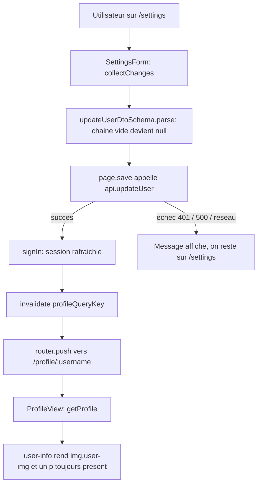

# Paramètres — bio et image, et ne jamais rendre « null »

## 1. Problème

Huit tests de la suite de conformité RealWorld échouent sur le trajet
`/settings → /profile/:username` : l'enregistrement des paramètres n'emmène nulle part
(la page reste sur elle-même, là où le contrat attend d'atterrir sur le profil), et une bio
absente ne rend **aucun** paragraphe dans `.user-info`, là où le contrat attend un
paragraphe **vide**. Le second point est le plus exposé pour un lecteur du dépôt public :
c'est le défaut d'affichage classique d'un champ nullable traversant le contrat sans être
normalisé au rendu.

## 2. Contraintes

- **La suite vendorée ne s'édite jamais** ([ADR 018](../../../docs/adr/018-conformite-e2e-suite-officielle-vendoree.md)).
  Les 8 tests visés (`settings.spec.ts` ×6, `null-fields.spec.ts` ×2) sont la **cible**, pas la
  preuve : la preuve reste nos tests de couche rattachés aux critères (rule 20).
- **Cycle req-driven obligatoire** : REQ écrit d'abord, tests par couche ensuite (vérifiés
  rouges), implémentation jusqu'au vert, constat e2e en dernier.
- **Markup RealWorld intact** (rule 11) : `.settings-page`, `.user-info`, `.user-img`, noms de
  champs `image` / `username` / `bio` / `email` / `password` (REQ-WEB-007 AC-2).
- **La règle « champ vide = absence » de REQ-WEB-004 AC-3 ne bouge pas.** Elle est déjà correcte
  pour l'effacement volontaire : `collectChanges` compare la saisie à l'état initial, donc effacer
  une bio renseignée **produit** la clé `bio: ''`, que `updateUserDtoSchema` normalise ensuite en
  `null` (`nullableText()`). Le point d'attention de l'issue est levé : rien à changer côté envoi.
- **AC-7 de REQ-WEB-004 ne doit pas régresser** : une session qui expire à l'enregistrement laisse
  l'utilisateur sur ses paramètres, avec son message et sa saisie. Toute navigation ajoutée doit
  donc être conditionnée au **succès**.
- **Séparation des responsabilités du formulaire** : `SettingsForm` ne connaît ni l'API ni le
  routeur ; la page lui fournit `onSave`. La navigation appartient à la page (rule 10, ADR 012).
- **Collision de vague 1** : #12 réécrit la traduction des échecs et touche `SettingsForm` /
  `api-client`. Ne pas toucher aux chemins d'erreur ici au-delà du strict nécessaire.

## 3. Hors-scope

- Toute modification de `apps/api` : `PUT /api/user` valide déjà via `updateUserDtoSchema`
  ([ADR 004](../../../docs/adr/004-persistance-alignee-sur-le-contrat.md)) et normalise `''` → `null`.
- L'avatar par défaut (`lib/avatar.ts`, `default-avatar.svg`) : déjà conforme, REQ-WEB-007 AC-3/AC-4.
- La traduction des messages d'échec et le mode dégradé — périmètre de #12.
- Le branchement `API_MODE === false` de la suite vendorée : notre pile tourne en mode API.
- Le changement de `username` ou d'`email` depuis les paramètres : déjà couvert, aucun test visé.
- La bascule du job de conformité en gate (#17).

## 4. Analyse technique

Deux causes indépendantes, deux fichiers, aucun recouvrement.

**Cause A — aucune navigation après enregistrement.**
`apps/web/src/app/settings/page.tsx` : `save()` appelle `api.updateUser(changes)` puis
`signIn(updated)`, et s'arrête là. Les six tests de `settings.spec.ts` attendent tous
`await expect(page).toHaveURL(new RegExp('/profile/' + username))` après le clic — quatre
d'entre eux bloquent même sur un `page.waitForURL(...)`. Le helper partagé
`conformance/e2e/helpers/profile.ts::updateProfile` attend lui aussi une URL hors `/settings`,
ce qui explique que deux tests de `null-fields.spec.ts` en dépendent indirectement.
La correction tient en une ligne dans `save()`, après `signIn` : pousser vers
`/profile/{updated.username}` — le username **de la réponse**, pas celui de l'état initial, pour
rester juste si l'utilisateur vient de le changer.

**Cause B — la bio absente ne rend rien.**
`apps/web/src/components/ProfileView.tsx` : `{profile.data.bio && 
{profile.data.bio}
}`.
Une bio `null` (compte neuf) ou `''` (bio effacée puis normalisée) supprime le paragraphe. Or
`null-fields.spec.ts` lit `page.locator('.user-info p').textContent()` et attend `''` : sans
élément, le locator expire et le test échoue. Le nom du test (« should not render as literal
null ») décrit le symptôme d'une autre implémentation ; **notre** défaut est l'inverse — pas de
`null` affiché, mais pas de paragraphe du tout. La correction est de rendre le `
`
inconditionnellement avec `bio ?? ''`, en alignant la bio sur la règle que `avatarUrl` applique
déjà à l'image : la chaîne vide et `null` sont la même absence.

**Fraîcheur du profil après enregistrement.** Le cache TanStack Query est monté à la racine et
porte `staleTime: 30s`. Un utilisateur qui enregistre deux fois de suite (c'est exactement ce
que fait `setting then clearing bio`) revient sur `/profile/:username` avec une entrée encore
fraîche et voit sa **valeur précédente**. Le rechargement complet du test masque aujourd'hui le
défaut, mais le symptôme décrit par l'issue (« renseigner puis effacer n'affiche pas la valeur
précédente ») est précisément celui-là. On invalide donc `profileQueryKey(username)` à
l'enregistrement plutôt que de miser sur un `page.goto()`.

### Matrice des effets observables

| Transition | Sous-type `bio` | Sous-type `image` |
|---|---|---|
| Saisie d'une valeur puis enregistrement | La clé `bio` part avec la valeur ; le profil rend `
` avec ce texte | La clé `image` part avec l'URL ; le profil rend `img.user-img[src]` avec cette URL |
| Effacement d'une valeur existante | La clé `bio: ''` part, normalisée en `null` ; le profil rend un `
` **vide** | La clé `image: ''` part, normalisée en `null` ; le profil rend `default-avatar.svg` |
| Champ jamais renseigné (compte neuf) | Aucune clé envoyée ; le profil rend un `
` vide, jamais `null` | Aucune clé envoyée ; le profil rend `default-avatar.svg` |
| Enregistrement réussi | Navigation vers `/profile/:username`, cache profil invalidé | Navigation vers `/profile/:username`, cache profil invalidé |
| Enregistrement en échec (401 / 500 / réseau) | Aucune navigation, message et saisie conservés (AC-7) | N/A — même chemin, aucun effet propre à l'image |

## 5. Critères d'acceptation (binaires)

- [ ] **REQ-WEB-004 / AC-8** — Given un utilisateur connecté sur `/settings` qui modifie sa bio,
  son image ou les deux, When l'enregistrement répond 200, Then la page navigue vers
  `/profile/{username}` en utilisant le username **du compte renvoyé par l'API**.
- [ ] **REQ-WEB-004 / AC-9** — Given un enregistrement qui échoue (401, 500 ou panne de transport),
  When la réponse arrive, Then aucune navigation n'a lieu : le formulaire reste affiché avec sa
  saisie et son message (AC-7 préservé).
- [ ] **REQ-WEB-004 / AC-10** — Given un profil déjà présent dans le cache de requêtes,
  When l'enregistrement réussit, Then l'entrée `profileQueryKey(username)` est invalidée, de sorte
  que la page de profil affiche les valeurs enregistrées et non la copie précédente.
- [ ] **REQ-WEB-007 / AC-9** — Given un profil dont la `bio` vaut `null` ou la chaîne vide,
  When `.user-info` est rendu, Then il contient un élément `
` dont le contenu textuel est vide —
  jamais absent, jamais la chaîne littérale `null`.
- [ ] **REQ-WEB-007 / AC-10** — Given un profil dont la `bio` porte un texte,
  When `.user-info` est rendu, Then ce même `
` porte exactement ce texte.

Preuve e2e attendue en fin de cycle (constat, pas critère) : les 6 tests de `settings.spec.ts` et
les 2 tests de bio de `null-fields.spec.ts` passent au vert sous `pnpm conformance:e2e`.

## 6. Breadboard

**Places**

- `/settings` — `apps/web/src/app/settings/page.tsx` (Client Component, ADR 012).
- `/profile/:username` — `apps/web/src/components/ProfileView.tsx` (Client Component, ADR 020).

**Seams**

| Seam | Aujourd'hui | Après |
|---|---|---|
| `SettingsPage.save(changes)` | `updateUser` → `signIn` | `updateUser` → `signIn` → `invalidateQueries(profileQueryKey(updated.username))` → `router.push('/profile/' + encodeURIComponent(updated.username))` |
| `SettingsForm` | ignore le routeur | **inchangé** — c'est la page qui navigue, le formulaire reste sans dépendance au routage |
| `ProfileView` rendu bio | `{bio && 
{bio}
}` | `
{bio ?? ''}
` — un seul `
` dans `.user-info`, toujours présent |

**Affordances**

- `useQueryClient()` est disponible dans la page : `ApiProvider` monte `QueryClientProvider` au
  layout racine.
- `profileQueryKey` existe déjà dans `apps/web/src/lib/content-query.ts` — le réutiliser, ne pas
  recomposer la clé à la main.
- `router.push` est déjà mocké dans `apps/web/src/app/settings/page.spec.tsx`
  (`vi.mock('next/navigation', …)`) : les tests de navigation s'y branchent sans nouveau harnais.

**Documentation**

- REQ-WEB-004 : ajouter AC-8/AC-9/AC-10, rattacher l'issue `14` dans `related.issues`.
- REQ-WEB-007 : ajouter AC-9/AC-10, rattacher l'issue `14`.
- Aucun ADR nouveau : la navigation post-enregistrement est un comportement du contrat RealWorld,
  pas un choix d'architecture ; la normalisation du vide au rendu est le pendant front de l'ADR 004
  et de la règle déjà posée par `lib/avatar.ts`. Si le gate Shape juge que la nullabilité au rendu
  mérite une décision écrite, elle s'ajoute en amendement à l'ADR 004 plutôt qu'en ADR 021.

## 7. Slices

1. **Slice 1 — Le rendu ne cache plus l'absence.** REQ-WEB-007 AC-9/AC-10 écrits ; tests ajoutés à
   `apps/web/src/components/ProfileView.spec.tsx` (bio `null`, bio `''`, bio renseignée) vérifiés
   rouges ; `ProfileView` rend le `
` inconditionnel. Livrable seul : corrige les 2 tests de
   `null-fields.spec.ts` sans dépendre de la slice 2.
2. **Slice 2 — L'enregistrement mène au profil.** REQ-WEB-004 AC-8/AC-9/AC-10 écrits ; tests ajoutés
   à `apps/web/src/app/settings/page.spec.tsx` (navigation au succès, absence de navigation au 401
   et sur panne réseau, invalidation du cache profil) vérifiés rouges ; `save()` complété.
   Livrable seul : corrige les 6 tests de `settings.spec.ts`.
3. **Slice 3 — Constat de conformité.** `pnpm test`, `pnpm lint`, `pnpm typecheck`,
   `pnpm requirements:validate`, puis `pnpm conformance:e2e` pour constater les 8 tests visés au
   vert et l'absence de régression sur les autres fichiers de la suite.
