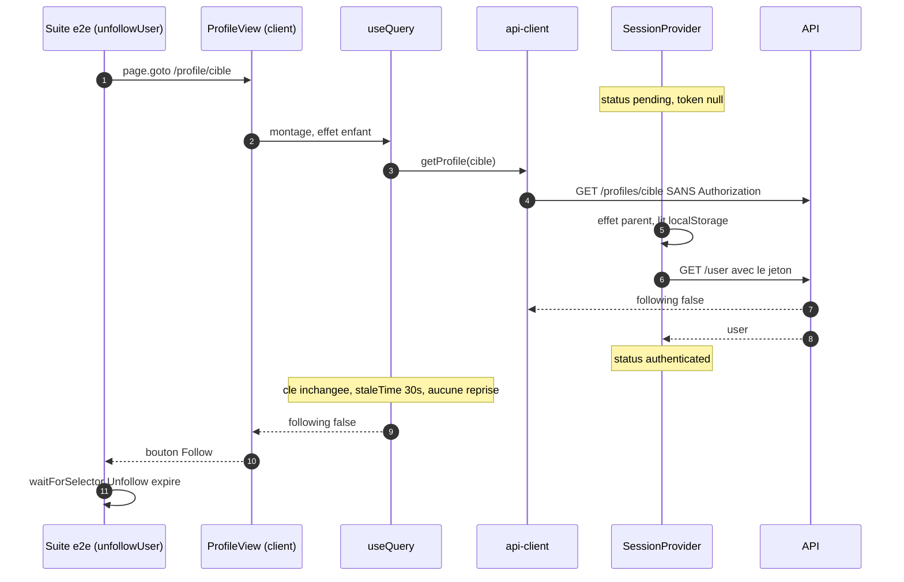

# Dossier de cadrage — #15 suivi, profil d'autrui et flux personnalisé

## 0. Décision de la porte Shape (2026-08-07)

**Portée resserrée à REQ-WEB-005 et REQ-WEB-009.** Le dossier amendait quatre REQ ; la mesure sur
`staging` (`4dba489`) n'en justifie que deux. Les trois tests qui échouent — `social.spec.ts:22`
(suivre / ne plus suivre), `:62` (profil d'autrui), `:153` (articles des suivis dans le flux) —
relèvent de REQ-WEB-005 et REQ-WEB-009. **Le quatrième geste social du corps de l'issue, les favoris
sur le profil, passe déjà.**

REQ-WEB-012 AC-13 et REQ-WEB-015 AC-7 sont donc **retirés de ce lot** : ils décrivaient du
comportement qui fonctionne, et les amender aurait élargi la surface touchée sans qu'aucun test ne
l'exige (rule 03, impact minimal).

L'argument inverse a été pesé : ces deux surfaces dépendent de la même course session/requête et
pourraient tomber par un simple glissement de timing. Il est écarté ici parce qu'un lot se justifie
par un défaut mesuré, pas par un défaut plausible — et que le correctif de REQ-WEB-005 traite la
cause commune. Si un test des favoris tombe plus tard, il ouvrira son propre lot, avec une mesure
pour l'appuyer.

## 1. Problème

Quatre tests de la suite e2e officielle (lot 4/5 de #11) déclarent le front non conforme sur les
gestes sociaux : suivre puis cesser de suivre un compte, consulter le profil d'un autre, retrouver
ses favoris sur son profil, et voir dans le flux personnel les articles des comptes suivis. C'est le
dernier lot de #11, donc le dernier obstacle avant que `pnpm conformance:e2e` puisse être considérée
pour la bascule en gate (#17, décidée séparément).

Le corps de l'issue pose une hypothèse — « un état social rendu côté serveur pour un lecteur anonyme
puis non réhydraté produirait exactement ces symptômes ». Elle est **fausse sur le mécanisme et vraie
sur l'effet** : depuis l'[ADR 020](../../../docs/adr/020-chargement-client-des-pages-de-contenu.md)
le profil n'est plus rendu côté serveur du tout, mais la requête cliente qui l'a remplacé part
**avant que la session ait résolu son jeton**, et rien ne la refait ensuite. Le résultat est le même :
`following` vaut `false` pour un lecteur qui suit, à chaque chargement de page.

## 2. Contraintes

- **La suite vendorée ne s'édite jamais**
  ([ADR 018](../../../docs/adr/018-conformite-e2e-suite-officielle-vendoree.md),
  [ADR 016](../../../docs/adr/016-suite-de-conformite-vendoree.md)) : `pnpm conformance:drift` compare
  la copie à l'amont octet pour octet, helpers imbriqués compris. Une assertion qui échoue est un
  défaut du front, jamais un défaut de la suite.
- **Contourner un sélecteur est la même triche qu'éditer l'assertion** — la contrainte que #16 a
  écrite et qu'il faut relire ici : rendre autre chose que ce que le contrat décrit, pour faire
  disparaître un match, réécrit le contrat par un autre chemin.
- **Cycle req-driven** ([rule 20](../../../.claude/rules/20-requirements-docs-as-code.md)) : REQ écrit
  ou amendé d'abord, tests par couche rouges ensuite, implémentation jusqu'au vert, portion e2e
  vérifiée en dernier. Les tests e2e sont la **cible**, jamais la preuve.
- **Markup RealWorld** ([rule 11](../../../.claude/rules/11-design-realworld.md)) : les libellés
  viennent de `apps/web/conformance/e2e/SELECTORS.md` (« Follow » / « Unfollow » suivi du username,
  « Your Feed », « Favorited ») et de `docs/prd/specifications/frontend/templates.md`.
- **Frontière serveur/client** : `following` et `favorited` sont **relatifs au lecteur** (règle R-5),
  donc résolus côté navigateur ([ADR 012](../../../docs/adr/012-rendu-hybride-et-session-client.md)).
  Le préchargement serveur des listes ([ADR 015](../../../docs/adr/015-prefetch-serveur-et-hydratation-des-listes.md))
  reste anonyme **par construction** : il n'a aucun jeton à envoyer, et l'ADR 015 §4 interdit déjà de
  précharger le flux personnel.
- **Budget de temps par test** : `playwright.base.ts` fixe `timeout: 15_000`, `actionTimeout: 5_000`,
  `workers: 1`, `fullyParallel: false`. Le test 1 fait déjà deux inscriptions complètes et deux
  chargements de profil dans cette enveloppe. Toute solution qui ajoute un aller-retour **sériel**
  doit être chiffrée contre ce budget, pas supposée gratuite. Relever ces valeurs serait la triche
  décrite ci-dessus, en un chiffre.
- **Trois des quatre lots frères ont atterri sur `staging` depuis la mesure** : #14 (`16f9dff`), #16
  (`c4ddaa9`), #13 (`ab77fbf`). Le point de mesure a bougé (§4.0).
- **Rien n'a encore été vérifié par la CI** : quatre runs consécutifs échouent faute de runner
  GitHub (voir `state.md`). Annoncer vert sur la foi des portes locales est le faux négatif que la
  [rule 02](../../../.claude/rules/02-workflow-dev.md) nomme.

## 3. Hors-scope

- **Le préchargement serveur des listes** (`prefetchFeed`) : il part anonyme, donc les aperçus
  hydratés portent `favorited: false` pour un lecteur connecté, et `staleTime: 30_000` empêche le
  client de rectifier avant expiration. C'est **le même défaut de famille** (§4.5) et il est réel,
  mais aucun des quatre tests visés ne l'exerce, et le corriger touche l'ADR 015 — donc une décision
  d'architecture qui mérite son propre ADR et sa propre issue. Nommé ici pour qu'il ne se
  redécouvre pas comme une surprise.
- La bascule de favori **depuis l'aperçu en liste** et l'invite anonyme des commentaires : lot #16,
  atterri.
- Le flux porté par l'URL, la pagination, `?feed=following` comme route : lot #13, atterri. Ce lot
  **consomme** ce travail, il ne le refait pas.
- Les messages d'erreur HTTP et le mode dégradé : lot #12.
- Toute notion de compteur d'abonnés, de liste d'abonnements, de notification : absente de la spec
  RealWorld comme de la suite.
- La bascule du job CI en gate : #17, décidée après plusieurs runs verts consécutifs
  ([rule 21](../../../.claude/rules/21-cadre-reproductible.md) étape 5).

## 4. Analyse technique

### 4.0 Le point de mesure a bougé sous l'issue — deuxième occurrence

Les 50 échecs de #11 ont été mesurés le 2026-08-06 au matin. Depuis, trois des quatre lots frères
sont sur `staging` :

| commit | lot | effet sur `social.spec.ts` |
|---|---|---|
| `c4ddaa9` | #16 | épingle le SPKI du certificat jetable dans `launchOptions` — **les contextes fabriqués par `browser.newContext()` voient enfin l'API**. `playwright.config.ts` nomme explicitement `social.spec.ts:74/165`. |
| `c4ddaa9` | #16 | le bouton de favori de la page article bascule son libellé `Favorite Article` ↔ `Unfavorite Article` — ce que le test 5 attend pour valider son favori. |
| `ab77fbf` | #13 | `/?feed=following` existe comme route, et `HomeFeed` garde le flux personnel derrière `status === 'authenticated'` — ce que le test 6 emprunte. |

Trois des quatre échecs visés avaient donc une cause qu'un autre lot vient de payer. **Aucune ligne
de code avant d'avoir rejoué `pnpm conformance:e2e social.spec.ts` sur `staging` à jour**
(slice 1). Le dépôt a déjà payé ce prix deux fois ; #16 l'avait déjà écrit dans son propre §4.0, et
c'est la seconde fois de suite que le cadrage d'un lot de #11 commence par là.

Ce que la re-mesure doit trancher, test par test :

| test | ligne | cause d'hier | statut attendu après les trois merges |
|---|---|---|---|
| 1 — follow / unfollow | `:23` | contexte isolé sans TLS **et** §4.1 | **toujours rouge** — §4.1 n'a été corrigé par personne |
| 2 — profil propre | `:47` | — | vert hier, vert aujourd'hui (non visé) |
| 3 — profil d'autrui | `:62` | `browser.newContext()` ligne 74 | probablement vert |
| 4 — articles du profil | `:98` | — | vert hier, vert aujourd'hui (non visé) |
| 5 — favoris du profil | `:114` | libellé du bouton de favori (#16) | probablement vert |
| 6 — flux personnel | `:150` | `browser.newContext()` ligne 165 (+ `?feed=following`) | probablement vert |

Si la re-mesure confirme ce tableau, le périmètre de code de ce lot se réduit à §4.1 et le reste du
travail est de **prouver** les trois autres — ce qui est un résultat, pas une déception : un lot qui
constate qu'un autre l'a déjà payé vaut mieux qu'un lot qui repaie.

### 4.1 Le défaut que personne n'a payé : la requête relative au lecteur part sans jeton

C'est le cœur du lot, et il est structurel plutôt que local.

`ProfileView` est un composant **client** depuis l'ADR 020. Il demande le profil au montage :

```tsx
// apps/web/src/components/ProfileView.tsx
const profile = useQuery({
  queryKey: profileQueryKey(username),
  queryFn: () => api.getProfile(username),
  // …
})
```

Le client API lit le jeton **au moment de la requête**, dans la session (`api-provider.tsx`,
`getToken: () => tokenRef.current`). Or au montage ce jeton vaut `null`, et pas par hasard :

- `SessionProvider` part délibérément de `{ user: null, status: 'pending', token: null }` pour que le
  premier rendu client soit identique au rendu serveur (ADR 012) ;
- le jeton n'est lu dans `localStorage` que dans un **effet** (`useRehydration`), puis vérifié par un
  `GET /user` — donc au mieux un aller-retour plus tard ([ADR 014](../../../docs/adr/014-conformite-au-contrat-de-selecteurs-e2e.md)) ;
- React exécute les effets **des enfants vers le parent**. `ProfileView` est plus profond que
  `SessionProvider` : l'effet de montage de `useQuery` s'exécute donc **avant** celui qui va seulement
  commencer à chercher le jeton.

La requête part anonyme. L'API répond correctement — pour un appelant anonyme, `following` vaut
`false` (R-5). Et rien ne la reprend ensuite :

- `profileQueryKey(username)` **ne contient pas l'identité du lecteur** : la clé ne change pas quand
  la session résout, donc pas de nouvelle requête ;
- `staleTime: 30_000` (`api-provider.tsx`) rend l'entrée fraîche pendant trente secondes ;
- `invalidateAuthorCaches` n'est appelée que depuis la page de paramètres (REQ-WEB-004) ;
- `refetchOnWindowFocus` est désactivé.

**Conséquence observable, exactement celle du test 1** : `unfollowUser()` recharge
`/profile/{cible}` par un `page.goto` complet, la page réaffiche « Follow », et le
`waitForSelector('button:has-text("Unfollow")', { timeout: 10000 })` du helper expire.



Pourquoi `followUser()` réussit et `unfollowUser()` échoue, alors que les deux passent par le même
chemin : au **premier** passage le lecteur ne suit effectivement personne, donc la réponse anonyme
`following: false` **coïncide avec la vérité**. Le clic, lui, part bien authentifié — `tokenRef` est
à jour à l'instant du clic. Le défaut n'est visible qu'au second chargement, celui où la réponse
anonyme et la vérité divergent. C'est le genre de défaut qu'un test de composant ne voit jamais :
`FollowButton.spec.tsx` monte le bouton sous une session **déjà résolue**.

### 4.2 Le second verrou : `useFollowState` ignore un `following` qui change

Même si la requête était reprise, le bouton ne bougerait pas :

```tsx
// apps/web/src/components/FollowButton.tsx
function useFollowState(profile: Profile): [boolean, (next: boolean) => void] {
  const [following, setFollowing] = useState(profile.following)
  const [renderedFor, setRenderedFor] = useState(profile.username)

  if (profile.username !== renderedFor) {
    setRenderedFor(profile.username)
    setFollowing(profile.following)
  }
  // …
}
```

La resynchronisation est conditionnée au **changement de username**. Une réponse fraîche pour le
*même* profil, portant un `following` différent, est donc silencieusement ignorée. Le motif correct
existe déjà dans ce dépôt — `ArticlePreview` dérive l'état des props et ne garde en local que l'écart
produit par la mutation en cours — et son commentaire affirme même que `FollowButton` procède
ainsi :

> Le remède est celui déjà appliqué au bouton de suivi : ne garder en local que ce que le serveur ne
> sait pas encore, et laisser les props gouverner le reste.

C'est faux : `FollowButton` copie, il ne dérive pas. Un commentaire qui décrit un fichier voisin
comme conforme à un motif qu'il n'applique pas est exactement le genre d'affirmation que #14 a déjà
corrigée deux fois. Le corriger fait partie du lot, parce que la fonction à changer est celle-là.

### 4.3 Deux façons de résoudre §4.1, une seule sans clignotement

| Option | Ce que ça fait | Trade-off |
|---|---|---|
| **A — attendre la résolution de la session (recommandée)** | `enabled: status !== 'pending'` sur les requêtes relatives au lecteur (`ProfileView`, `ArticleView`). L'écran d'attente existe déjà dans les deux composants. | **Le lecteur anonyme ne paie rien** : `useRehydration` pose `anonymous` de façon synchrone quand il n'y a pas de jeton — un rendu de plus, zéro requête. Le lecteur connecté paie **un** aller-retour local (`GET /user`) avant le contenu. Une seule requête, une seule valeur affichée, aucun clignotement. Coût sur le budget de 15 s : négligeable contre une API locale, **à mesurer et non à supposer** (slice 1). |
| B — porter l'identité du lecteur dans la clé de cache | `['profile', username, viewerKey]` : la requête anonyme part tout de suite, la clé change quand la session résout, une seconde requête corrige. | Le contenu public s'affiche un aller-retour plus tôt. Mais **deux** requêtes par page pour tout lecteur connecté, et surtout un bouton qui affiche « Follow » puis bascule en « Unfollow » sans geste de l'utilisateur — un clignotement que les helpers de la suite, qui font `waitForSelector` juste après le `goto`, peuvent gagner de vitesse dans les deux sens. Instabilité fabriquée. |
| C — invalider les familles de clés à chaque transition de session | Un effet dans le fournisseur. | Même double requête que B, plus une invalidation large qui frapperait aussi les flux **préchargés** — donc annulerait l'ADR 015 pour rectifier un champ. Le remède déborde très au-delà du mal. |

A est retenue au cadrage sous réserve de la mesure de slice 1. La distinction qu'elle exploite est
celle que REQ-WEB-002 a déjà payée : `pending` n'est pas `anonymous`, et le confondre a déjà coûté un
défaut sur `/settings` puis sur `/?feed=following`. C'est le **troisième** endroit du même dépôt où
la même confusion se paie ; elle mérite d'être écrite comme une règle plutôt que corrigée une
troisième fois au cas par cas.

### 4.4 Les trois autres tests : ce qu'il reste à prouver, pas à écrire

- **Test 3 (profil d'autrui)** — `expect(page.locator('h4')).toHaveText(target)` est une assertion
  **stricte** : elle exige un `h4` et un seul sur la page. `ProfileView` en rend un ; l'écran
  d'attente en rend un autre, mais jamais en même temps. `ArticlePreview` n'en porte aucun (`h1` pour
  le titre). L'invariant tient, mais il tient par accident : ajouter un `h4` n'importe où sur cette
  page casserait le test sans rapport avec le suivi. À consigner, pas à corriger.
- **Test 5 (favoris du profil)** — le chemin dépend entièrement du libellé du bouton de favori que
  #16 vient de corriger, puis de la route `/profile/:username/favorites`, qui existe. Le clic sur
  l'onglet vise `a:has-text("Favorited")` ; notre libellé est « Favorited Articles », la
  sous-chaîne matche. La liste des favoris est **publique** — filtre `favorited={username}` — donc
  préchargée côté serveur, sans le défaut §4.1.
- **Test 6 (flux personnel)** — `HomeFeed` ne monte `FeedList` que sur `status === 'authenticated'`,
  donc la requête `GET /articles/feed` part **avec** le jeton : c'est le seul endroit du dépôt où le
  piège §4.1 a déjà été évité, et il l'a été explicitement. Ce lot ne le refait pas ; il vérifie que
  l'article du compte suivi ressort effectivement dans la liste, ce qu'aucun AC n'affirme aujourd'hui.

### 4.5 Le même défaut, sur une surface qu'on ne touche pas

`prefetchFeed` interroge l'API avec `createServerApiClient()`, sans jeton — c'est correct et
inévitable, le serveur ne connaît pas la session (ADR 012). Les aperçus transmis par
`HydrationBoundary` portent donc `favorited: false` pour tout le monde, et `staleTime: 30_000`
empêche le client de rectifier pendant trente secondes. Un lecteur connecté qui recharge l'accueil
voit ses propres favoris dépointés.

C'est la même famille que §4.1, sur une surface plus large et avec un arbitrage d'architecture
derrière (l'ADR 015 échange précisément la fraîcheur relative au lecteur contre un premier affichage
sans aller-retour). Aucun des quatre tests visés ne l'exerce. Il reste **hors-scope** et nommé, plutôt
que corrigé au passage par une option A élargie qui viderait l'ADR 015 de son objet.

### 4.6 Deux dérives documentaires à corriger en même temps

- **REQ-WEB-005 AC-1** affirme : « le HTML rendu par le serveur porte déjà le username, la bio et
  l'image — sans attendre l'exécution du JavaScript ». C'était vrai avant l'ADR 020 ; ce ne l'est plus
  depuis `f51037c`. Le REQ liste pourtant l'ADR 020 dans ses `related.adrs` : quelqu'un a mis à jour
  la traçabilité sans relire le critère. Sa section « Contexte » répète l'affirmation périmée
  (« contenu rendu côté serveur en anonyme (AC-1) »).
- **Le test qui couvre AC-1** (`ProfileView.spec.tsx:123`, « rend le username et la bio du compte
  demandé ») est un test RTL : il prouve que React rend le username, ce qui n'a jamais été la question
  d'AC-1. Un critère faux, couvert par un test vert qui ne le teste pas — c'est la définition d'une
  couverture tautologique, et c'est le genre d'entrée qui appartient à `artifacts/lessons.md`.

### Matrice des effets observables

| Transition | Bouton de suivi (profil) | Bouton de suivi (méta d'article) | Bouton de favori (page article) | Flux personnel (`/?feed=following`) | Onglet « Favorited » du profil |
|---|---|---|---|---|---|
| Chargement, lecteur anonyme | `Follow {u}`, `btn-outline-secondary` (inchangé) | idem (inchangé) | `Favorite Article`, `btn-outline-primary` (inchangé) | redirection vers `/login`, aucun `GET /articles/feed` (inchangé, #13) | liste publique des favoris du compte (inchangé) |
| Chargement, session en cours de résolution (`pending`) | écran d'attente `.profile-page` sans `.user-info` — **aucun bouton rendu à partir d'une réponse anonyme** (change) | méta non rendue tant que l'article n'est pas arrivé (change) | idem, non rendu (change) | `.feed-status` « Loading articles... » (inchangé, #13) | liste préchargée déjà affichée (inchangé) |
| Chargement, lecteur connecté qui **ne suit pas** | `Follow {u}` (inchangé — la réponse anonyme coïncidait) | idem (inchangé) | selon `favorited` de la réponse authentifiée (change) | liste des articles des comptes suivis (inchangé) | idem (inchangé) |
| Chargement, lecteur connecté qui **suit déjà** | **`Unfollow {u}`, `btn-secondary`** (change — affichait `Follow`) | **`Unfollow {u}`** (change) | **`Unfavorite Article`, `btn-primary`** si favorisé (change) | idem (inchangé) | idem (inchangé) |
| Suivre (réponse de l'API) | `Unfollow {u}`, `btn-secondary` (inchangé) | idem (inchangé) | N/A | l'article de la cible entre au prochain chargement du flux (inchangé) | N/A |
| Cesser de suivre (réponse de l'API) | `Follow {u}`, `btn-outline-secondary` (inchangé) | idem (inchangé) | N/A | l'article de la cible en sort au prochain chargement (inchangé) | N/A |
| Bascule de suivi qui échoue | état d'avant le clic conservé + `.error-messages` (inchangé) | idem (inchangé) | N/A | N/A | N/A |
| Réponse fraîche portant un `following` différent, même username | **le bouton suit la réponse** (change — était ignorée, §4.2) | **idem** (change) | déjà gouverné par les props (inchangé) | N/A | N/A |
| Chargement sur son propre profil | lien « Edit Profile Settings », aucun bouton (inchangé) | N/A — la méta masque déjà les actions pour l'auteur (inchangé) | N/A — l'auteur voit ses actions d'édition (inchangé) | N/A | liste de ses propres favoris (inchangé) |
| Session `unavailable` (jeton conservé, API muette) | requête émise **avec** le jeton conservé, puis message d'indisponibilité (change) | idem (change) | idem (change) | `.feed-status` d'indisponibilité, sans redirection (inchangé, REQ-WEB-016) | inchangé |

## 5. Critères d'acceptation (binaires)

- [ ] **REQ-WEB-005 / AC-1 (amendé)** — Given un username existant, When la page de profil est
      demandée, Then l'écran d'attente `.profile-page` est rendu **sans** `.user-info`, puis le
      username, la bio et l'image du compte apparaissent une fois la réponse arrivée — le rendu vient
      du navigateur depuis l'ADR 020, et non plus du serveur.
- [ ] **REQ-WEB-005 / AC-7** — Given un lecteur porteur d'un jeton, When il charge `/profile/{u}`,
      Then **aucune** requête `GET /profiles/{u}` n'est émise tant que `status === 'pending'`, et la
      requête effectivement émise porte l'en-tête `Authorization`.
- [ ] **REQ-WEB-005 / AC-8** — Given un lecteur connecté qui suit déjà `{u}`, When il charge (ou
      recharge) `/profile/{u}`, Then le bouton porte `Unfollow {u}` et la classe `btn-secondary`
      **avant tout clic**.
- [ ] **REQ-WEB-005 / AC-9** — Given un bouton de suivi monté sur un profil, When une réponse fraîche
      pour **le même username** porte un `following` différent de celui affiché, Then le bouton suit
      la réponse — l'état local ne conserve que l'écart produit par une bascule en cours.
- [ ] **REQ-WEB-009 / AC-13** — Given un lecteur connecté qui suit un compte ayant publié un article,
      When il ouvre `/?feed=following`, Then l'article de ce compte est listé — la garde
      d'authentification de l'ADR 022 ne suffit pas à l'affirmer, elle ne dit que ce qui **n'est pas**
      demandé.
- [ ] **REQ-CONF-002 / AC-9** — Given `staging` à jour et le harnais e2e, When
      `pnpm conformance:e2e social.spec.ts` est exécuté, Then les six tests du fichier passent, dont
      les quatre visés par #15 (`:23`, `:62`, `:114`, `:150`), sans relèvement d'aucun délai de
      `playwright.config.ts` ni de `playwright.base.ts`.
- [ ] **Non-régression du préchargement** — Given l'accueil et la page d'un tag, When elles sont
      chargées par un visiteur anonyme, Then leur premier HTML porte toujours les `.article-preview`
      préchargés : la correction du §4.1 ne déplace **aucune** liste publique vers le navigateur.

## 6. Breadboard

**Places**

- `apps/web/src/components/ProfileView.tsx` — la requête `profileQueryKey`. Seul endroit à changer
  pour §4.1 côté profil ; l'écran d'attente existe déjà et porte déjà la contrainte de sélecteur
  (`.profile-page` sans `.user-info` imbriqué).
- `apps/web/src/components/ArticleView.tsx` — la requête `articleQueryKey`. Même changement. La
  requête `commentsQueryKey`, elle, est **publique** : elle ne doit pas être retardée.
- `apps/web/src/components/FollowButton.tsx` — `useFollowState`, pour §4.2.
- `docs/requirements/functional/web/REQ-WEB-005.md` — AC-1 amendé, AC-7/8/9 ajoutés, section
  « Contexte » réalignée sur l'ADR 020.
- `docs/requirements/functional/web/REQ-WEB-009.md`,
  `docs/requirements/non-functional/conformance/REQ-CONF-002.md` — un AC chacun.
  (REQ-WEB-012 et REQ-WEB-015 sont hors lot depuis la porte Shape, voir section 0.)
- `apps/web/src/components/ArticlePreview.tsx` — **le commentaire seulement** (§4.2), qui redevient
  vrai une fois `FollowButton` corrigé.

**Affordances / seams**

- `useSession().status` ← `SessionProvider`. C'est la couture unique : `pending` est déjà distingué
  de `anonymous` et d'`unavailable` (REQ-WEB-002), et `HomeFeed` s'en sert déjà exactement ainsi. La
  correction consomme un invariant existant, elle n'en crée pas.
- `useQuery({ enabled })` ← TanStack Query. `isPending` reste vrai tant que la requête est désactivée,
  donc **les écrans d'attente déjà écrits couvrent le nouvel état sans code supplémentaire** — c'est
  ce qui rend l'option A si peu coûteuse.
- `prefetchFeed` / `HydrationBoundary` — **non touchés**. Frontière explicite de §4.5.
- `Navbar`, `FeedToggle`, `ArticlesToggle` — non touchés : ils portent les liens que la suite compte
  ailleurs (`auth.spec.ts`, `navigation.spec.ts`).

**Tests par couche** ([rule 16](../../../.claude/rules/16-tests-coverage.md))

- `apps/web/src/components/ProfileView.spec.tsx` — AC-1 amendé, AC-7 (aucun appel tant que la session
  est `pending`, appel émis ensuite), AC-8. Le test doit monter le composant sous une session
  **`pending` puis résolue**, ce qu'aucun test actuel ne fait : c'est là que se joue la
  non-tautologie.
- `apps/web/src/components/FollowButton.spec.tsx` — AC-9 : même username, `following` qui change dans
  les props. Le test existant « resynchronise quand on change de profil » reste, il couvre l'autre
  moitié.
- `apps/web/src/components/ArticleView.spec.tsx` — AC-13, et la preuve que les commentaires **ne
  sont pas** retardés par la garde.
- `apps/web/src/components/ArticlePreview.spec.tsx` — non modifiée : preuve que la liste n'a pas bougé.
- REQ-WEB-009 AC-13 : couvert par la portion e2e (slice 5), plus un test de `FeedList` sur le filtre
  envoyé s'il n'existe pas déjà.

## 7. Slices

1. **Re-mesurer avant d'écrire quoi que ce soit** — `pnpm conformance:e2e social.spec.ts` sur
   `staging` à jour. Consigner, pour chacun des six tests, le verdict et le message d'échec exact, et
   confronter au tableau du §4.0. Si le test 1 est vert, §4.1 est faux et le cadrage se reprend
   avant le plan. Aucune ligne de code dans cette slice.
2. **REQ d'abord** — amender REQ-WEB-005 (AC-1 réécrit, AC-7/8/9, section « Contexte »), ajouter
   REQ-WEB-009 AC-13, REQ-CONF-002 AC-9 ; rattacher l'issue 15 dans `related.issues`.
   `pnpm requirements:validate` vert.
3. **La requête relative au lecteur attend la session** — tests de couche rouges d'abord
   (`ProfileView.spec.tsx`, `ArticleView.spec.tsx` : aucun appel sous `pending`, appel authentifié
   ensuite), puis l'option retenue au gate. Mesurer le coût réel sur le budget de 15 s avant de
   conclure. Système cohérent en fin de slice.
4. **Le bouton de suivi dérive de ses props** — test de couche rouge dans `FollowButton.spec.tsx`
   (même username, `following` qui change), puis `useFollowState` réécrit sur le motif de
   `ArticlePreview`. Le commentaire d'`ArticlePreview` redevient vrai : le relire, ne pas le
   réécrire.
5. **Preuve e2e** — `pnpm conformance:e2e social.spec.ts`, six tests verts. C'est ici, et seulement
   ici, que la portion e2e devient une preuve. Vérifier aussi qu'`articles.spec.ts` et
   `comments.spec.ts`, dont les chemins traversent les mêmes composants, ne régressent pas.
6. **Consigner la leçon** — `artifacts/lessons.md` : « une requête relative au lecteur montée avant
   la résolution de la session part anonyme et ne se reprend jamais », avec les trois occurrences du
   dépôt (`/settings`, `/?feed=following`, `/profile/:username`) et le prédicat qui les distingue.
   C'est un échec évité, donc `lessons.md` et non un ADR ([rule 21](../../../.claude/rules/21-cadre-reproductible.md)).
