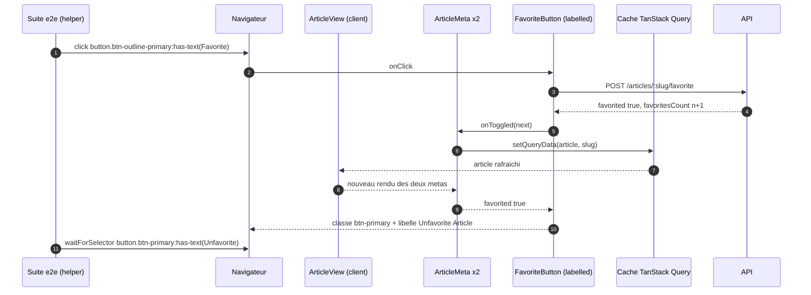

# Dossier de cadrage — #16 favori depuis la liste et invite à se connecter pour commenter

## 1. Problème

Trois tests de la suite e2e officielle (lot 5/5 de #11) déclarent le front non conforme sur deux
gestes de lecture : favoriser puis défavoriser un article depuis le parcours « accueil → page
article », et voir, en visiteur anonyme, une invite à se connecter à la place du formulaire de
commentaire. Ce sont les trois derniers écarts d'un lot que la spec RealWorld considère comme du
parcours de base, et le plus petit reste à payer avant que `pnpm conformance:e2e` puisse basculer en
gate (#17).

## 2. Contraintes

- **La suite vendorée ne s'édite jamais** ([ADR 018](../../../docs/adr/018-conformite-e2e-suite-officielle-vendoree.md),
  [ADR 016](../../../docs/adr/016-suite-de-conformite-vendoree.md)) : `pnpm conformance:drift` compare
  la copie à l'amont octet pour octet, helpers imbriqués compris. Une assertion qui échoue est un
  défaut du front.
- **Contourner un sélecteur est la même triche qu'éditer l'assertion.** Rendre un bouton là où la
  suite cherche un lien, pour faire disparaître un match, revient à réécrire le contrat par un autre
  chemin. Le geste légitime est de rendre ce que le contrat décrit.
- **Cycle req-driven ([rule 20](../../../.claude/rules/20-requirements-docs-as-code.md))** : REQ écrit ou
  amendé d'abord, tests par couche rouges ensuite, implémentation jusqu'au vert, portion e2e vérifiée
  en dernier. Les tests e2e sont la **cible**, jamais la preuve.
- **Markup RealWorld** ([rule 11](../../../.claude/rules/11-design-realworld.md)) : classes et libellés
  viennent de `docs/prd/specifications/frontend/templates.md` et de
  `apps/web/conformance/e2e/SELECTORS.md`, pas d'un choix local.
- **L'état affiché vient de la réponse de l'API**, jamais d'un incrément local
  ([REQ-WEB-011](../../../docs/requirements/functional/web/REQ-WEB-011.md) AC-4/AC-6). Ce parti pris
  n'est pas remis en cause ici.
- **Frontière serveur/client** : la page article est cliente depuis
  l'[ADR 020](../../../docs/adr/020-chargement-client-des-pages-de-contenu.md) ; `favorited` dépend du
  lecteur (règle R-5), donc reste résolu côté navigateur ([ADR 012](../../../docs/adr/012-rendu-hybride-et-session-client.md)).
- **Collision de vague 1** : #12 recouvre largement la surface de ce lot (api-client, formulaires). Le
  portail de conflit sérialise ; ne pas élargir la surface touchée au-delà du nécessaire.

## 3. Hors-scope

- La bascule de favori **depuis l'aperçu en liste** (`ArticlePreview`, variante `compact`) : aucun
  test du lot ne l'exerce, et son markup — cœur + compteur, sans libellé — est déjà celui du gabarit.
  Le titre de l'issue est trompeur sur ce point (voir §4.1).
- L'onglet « Favorited » du profil et le flux personnalisé : lot #15.
- Le préchargement, la pagination et le flux porté par l'URL : lot #13.
- Les messages d'erreur HTTP et le mode dégradé : lot #12.
- Toute reprise de parcours après connexion (`returnTo`, retour à l'article) : fonctionnalité neuve,
  sans rapport avec les trois échecs.
- La bascule du job CI en gate : #17, décidée après plusieurs runs verts consécutifs.

## 4. Analyse technique

### 4.0 Le point de mesure a bougé sous l'issue

Les 50 échecs de #11 ont été mesurés **avant** quatre commits de la même journée : `b8ce72c`
(ADR 019, terminateur TLS), `f51037c` (ADR 020, page article chargée depuis le navigateur), `fed7f3a`
(ajout du bouton de favori sur la page article), `2310ce8`. Les issues ont été ouvertes à 09:36 CEST,
ces commits ont atterri entre 16:21 et 17:59.

Conséquence directe : au moment de la mesure, la page article **n'avait pas de bouton de favori du
tout** — c'est ce que `fed7f3a` a corrigé. Le diagnostic « ordre des appels / invalidation du cache
TanStack Query / état optimiste non réconcilié » écrit dans le corps de l'issue décrivait donc une
cause plausible mais fausse. La cause d'aujourd'hui est ailleurs, et elle est lisible dans le code.

**Aucune ligne de code avant d'avoir rejoué les trois tests sur staging à jour** (slice 1). Le dépôt a
déjà payé deux fois le prix d'un verdict pris sur un artefact qui n'était pas celui qu'on croyait
tester ([rule 02](../../../.claude/rules/02-workflow-dev.md), garde-fous).

### 4.1 `articles.spec.ts:123` et `:139` — le libellé du bouton ne bascule pas

Les deux tests passent par le même helper, qui n'est pas éditable :

```ts
// apps/web/conformance/e2e/helpers/articles.ts
export async function favoriteArticle(page: Page) {
  await page.click('button.btn-outline-primary:has-text("Favorite")');
  await page.waitForSelector('button.btn-primary:has-text("Unfavorite")');
}
```

`apps/web/src/components/FavoriteButton.tsx` fait basculer la **classe** (`btn-outline-primary` →
`btn-primary`) mais fige le **libellé** de la variante `labelled` à `Favorite Article`, quel que soit
l'état. Le `waitForSelector` de la seconde ligne n'a donc jamais de cible : il expire, et les deux
tests tombent au même endroit. `articles.spec.ts:139` s'arrête au même appel, après avoir pourtant
correctement trouvé un article dont il n'est pas l'auteur.

Le commentaire qui justifie ce choix dans le composant est explicite et il est **faux** :

> Le libellé est celui du contrat de sélecteurs, y compris quand l'article est déjà favorisé : le
> gabarit RealWorld ne change que la classe du bouton, pas son texte.

`SELECTORS.md` dit l'inverse — il liste `Favorite` / `Unfavorite` comme texte de bouton sur la page
article, et `Favorite Article` comme variante. Le gabarit statique ne montre que l'état non favorisé,
donc il ne pouvait ni confirmer ni infirmer ; c'est le contrat de sélecteurs qui tranche. Le libellé
doit suivre l'état : `Favorite Article` ↔ `Unfavorite Article`.

Deux vérifications qui ferment le risque de régression latérale :

- `:has-text()` est un match de sous-chaîne insensible à la casse — `has-text("Favorite")` matche
  aussi `Unfavorite Article`. C'est la **classe** qui désambiguïse, et elle est déjà correcte.
- Aucun autre `.btn-outline-primary` ne vit sur la page article : `FollowButton` porte
  `btn-outline-secondary` / `btn-secondary`, et `Post Comment` porte `btn-primary` sans le mot
  `Unfavorite`.

Effet de bord attendu, hors périmètre mais à connaître : `social.spec.ts:115` dépend du même
`waitForSelector('button.btn-primary:has-text("Unfavorite")')`. Ce correctif retire donc un obstacle
au lot #15 sans que #16 en revendique le test.

### 4.2 `comments.spec.ts:102` — deux liens `/login` là où le contrat en attend un

```ts
await expect(page2.locator('a[href="/login"]')).toBeVisible();
```

Les assertions de locator Playwright sont **strictes** (`callOnSelector(..., { strict: true })` pour
`to.be.visible`, vérifié dans `playwright-core@1.62.1`) : un locator qui résout deux éléments lève une
`strict mode violation`, il ne réussit pas sur le premier. Or la page article d'un visiteur anonyme en
porte deux :

1. `Navbar` — `ANONYMOUS_LINKS` contient `{ href: '/login', label: 'Sign in' }` ;
2. `CommentSection` — l'invite `<Link href="/login">Sign in</Link> or <Link href="/register">sign up</Link>…`.

La même assertion passe partout ailleurs (`auth.spec.ts:26/67/97`, `user-fetch-errors.spec.ts:38/60/86/108`),
et toujours depuis l'accueil, où seule la barre porte le lien. La suite traite donc le lien de
connexion comme un **singleton de page**. `templates.md` ne décrit d'ailleurs aucune invite anonyme
dans la section commentaires : c'est un ajout de ce dépôt, écrit pour
[REQ-WEB-013](../../../docs/requirements/functional/web/REQ-WEB-013.md) AC-2, et c'est lui qui casse
l'invariant.

### 4.3 Le piège : ce test peut redevenir vert sans rien prouver

Le test crée son propre contexte : `const context2 = await browser.newContext()`. Les options du bloc
`use` de `playwright.config.ts` sont appliquées par la fixture `_contextFactory`, **pas** par
`browser.newContext()` — vérifié dans `@playwright/test@1.62.1`, qui ne pose aucun
`_defaultContextOptions`. `ignoreHTTPSErrors: true` ne suit donc pas.

Depuis l'ADR 019, le navigateur demande `https://api.realworld.show/api`, résolu vers un terminateur
TLS à certificat auto-signé jetable. Depuis l'ADR 020, la page article charge son contenu **depuis le
navigateur**. Composés, les deux donnent : sur `page2`, tous les appels d'API échouent en erreur de
certificat → `ArticleView` rend `ArticlePageNotice` en mode « indisponible » → `CommentSection` n'est
jamais montée → il ne reste qu'un seul `a[href="/login"]`, celui de la barre → **le test passe parce
que la page n'a pas chargé**.

C'est exactement le faux négatif que la rule 02 nomme : un vert obtenu sur un artefact qui n'est pas
celui qu'on croit tester. Le corriger fait partie de ce lot, sans quoi la portion e2e ne prouverait
rien de ce que les REQ affirment. `articles.spec.ts:292` et `social.spec.ts:74/165` créent leur
contexte de la même façon et sont exposés au même vide.

Le correctif vit dans **notre** fichier (`apps/web/playwright.config.ts`), jamais dans la suite : les
`launchOptions`, elles, sont portées par le navigateur et donc héritées par tout contexte. Deux formes
possibles, à trancher à l'implémentation — `--ignore-certificate-errors-spki-list=<sha256 du SPKI>`
(ne fait confiance qu'au certificat de ce run, que `test-e2e.sh` génère déjà et dont il peut calculer
l'empreinte) ou `--ignore-certificate-errors` (une ligne, mais tolère tout certificat ; le risque
reste borné par `--host-resolver-rules`, qui garde le run hors ligne). La première est préférable :
elle dit *ce* certificat, pas *n'importe lequel*.

### 4.4 Flux de la bascule de favori



Le chemin de données est déjà correct : la réponse fait autorité, elle est écrite dans le cache
partagé, donc les deux métas de la page se mettent à jour ensemble. Seule la dernière étape — ce que
le bouton **affiche** — ne satisfait pas le contrat.

### Matrice des effets observables

| Transition | Bouton en liste (`compact`) | Bouton page article (`labelled`) | Invite anonyme (commentaires) |
|---|---|---|---|
| Rendu initial, non favorisé | `btn-outline-primary`, cœur + compteur, aucun libellé (inchangé) | `btn-outline-primary`, `Favorite Article (n)` (inchangé) | N/A |
| Rendu initial, favorisé | `btn-primary`, cœur + compteur (inchangé) | `btn-primary`, **`Unfavorite Article (n)`** (change) | N/A |
| Bascule vers favorisé (réponse API) | `btn-primary`, compteur de la réponse (inchangé) | `btn-primary` + **libellé `Unfavorite Article`**, compteur de la réponse (change) | N/A |
| Bascule vers non favorisé (réponse API) | `btn-outline-primary`, compteur de la réponse (inchangé) | `btn-outline-primary` + libellé `Favorite Article` (change) | N/A |
| Bascule qui échoue | état d'avant le clic conservé (inchangé) | état d'avant le clic conservé, libellé compris (inchangé) | N/A |
| Rendu pour un visiteur anonyme | bouton présent, conduit à `/login` sans appel (inchangé) | idem (inchangé) | **plus de second `a[href="/login"]`** (change) |
| Rendu pour un lecteur connecté | N/A | N/A | formulaire de commentaire, aucune invite (inchangé) |

### Décision à trancher au gate — forme de l'invite anonyme

L'invariant à respecter est binaire : **un seul** `a[href="/login"]` visible sur la page article d'un
anonyme. Trois façons d'y arriver, une seule est honnête.

| Option | Trade-off |
|---|---|
| **A — l'invite reste, mais ne porte plus les liens d'authentification (recommandée)** | La phrase explique pourquoi il n'y a pas de formulaire ; la barre de navigation, qui porte déjà `Sign in` / `Sign up` à un endroit stable et testé, garde l'affordance. Une affordance par route d'authentification et par page. Coût : un aller vers le haut de page. Amende REQ-WEB-013 AC-2. |
| B — l'invite garde une affordance de connexion rendue en `<button>` qui navigue | Le sélecteur cesse de matcher sans que le comportement change : c'est éditer l'assertion par un autre chemin (§2). Et un bouton qui navigue est un lien mal déguisé. Écartée. |
| C — `/login?returnTo=<article>` | Meilleure UX, href distinct donc un seul match. Mais il faut que la page de connexion honore le paramètre, sans quoi le lien ment. Fonctionnalité neuve pour un lot de trois échecs. Écartée ici, candidate à une issue propre. |

## 5. Critères d'acceptation (binaires)

- [ ] **REQ-WEB-012 / AC-10** — Given un lecteur connecté qui n'est pas l'auteur, sur un article qu'il
      n'a pas favorisé, When il actionne le bouton de favori et que l'API répond, Then le bouton porte
      la classe `btn-primary` **et** le libellé `Unfavorite Article`, avec le compteur issu de la
      réponse.
- [ ] **REQ-WEB-012 / AC-11** — Given un article déjà favorisé par le lecteur, When la page article est
      rendue, Then le bouton porte `btn-primary` et le libellé `Unfavorite Article` **avant tout clic**
      ; When il est actionné et que l'API répond, Then il repasse à `btn-outline-primary` /
      `Favorite Article`.
- [ ] **REQ-WEB-012 / AC-12** — Given une bascule de favori sur la page article qui échoue, When l'API
      renvoie une erreur, Then la classe **et** le libellé restent ceux d'avant le clic — le libellé ne
      dérive pas de l'état plus que le compteur.
- [ ] **REQ-WEB-013 / AC-2 (amendé)** — Given un visiteur anonyme, When il atteint la section des
      commentaires, Then aucun formulaire ne lui est proposé et un message lui indique que la connexion
      est requise, sans dupliquer les liens d'authentification portés par la barre de navigation.
- [ ] **REQ-WEB-013 / AC-8** — Given un visiteur anonyme sur la page d'un article chargé, When la page
      est rendue, Then elle expose **exactement un** élément `a[href="/login"]` visible et aucun
      `textarea[placeholder="Write a comment..."]`.
- [ ] **REQ-CONF-002 / AC-8** — Given un test de la suite qui crée son propre contexte via
      `browser.newContext()`, When la page chargée appelle l'hôte d'API relayé en TLS par le harnais,
      Then l'appel aboutit et la page rend son contenu — la tolérance au certificat jetable est portée
      au niveau du navigateur, pas seulement du contexte fabriqué par la config.
- [ ] **Sortie de lot** — Given staging à jour et le harnais e2e, When
      `pnpm conformance:e2e articles.spec.ts` et `pnpm conformance:e2e comments.spec.ts` sont exécutés,
      Then `articles.spec.ts:123`, `articles.spec.ts:139` et `comments.spec.ts:102` passent, et aucun
      test de ces deux fichiers qui passait avant ne régresse.

## 6. Breadboard

**Places**

- `apps/web/src/components/FavoriteButton.tsx` — variante `labelled`. Seul endroit à changer pour
  §4.1 : le libellé devient une fonction de `favorited`, la variante `compact` reste intacte.
- `apps/web/src/components/CommentSection.tsx` — branche `!user`. Seul endroit à changer pour §4.2.
- `apps/web/playwright.config.ts` — `use.launchOptions.args`. Seul endroit à changer pour §4.3 ;
  éventuellement `scripts/test-e2e.sh` s'il faut exporter l'empreinte SPKI du certificat du run.

**Affordances / seams**

- `FavoriteButton` ← `ArticleMeta` (`variant="labelled"`, `onToggled` → `queryClient.setQueryData`) et
  ← `ArticlePreview` (`variant="compact"`). La prop `variant` est déjà la couture : le changement ne
  franchit aucune autre frontière.
- `CommentSection` ← `ArticleView`, montée seulement quand `comments.isSuccess`. Rien à toucher côté
  appelant.
- `Navbar` — **non touchée**. C'est elle qui porte le lien de connexion que la suite compte ; toucher
  à ses liens casserait `auth.spec.ts` et `navigation.spec.ts`.

**Tests par couche** ([rule 16](../../../.claude/rules/16-tests-coverage.md))

- `apps/web/src/components/ArticleMeta.spec.tsx` — AC-10, AC-11, AC-12 (RTL, api mockée).
- `apps/web/src/components/CommentSection.spec.tsx` — AC-2 amendé et AC-8 ; la ligne 83, qui affirme
  aujourd'hui `getByRole('link', { name: 'Sign in' })` → `href=/login`, change avec le REQ.
- `apps/web/src/components/ArticlePreview.spec.tsx` — non modifiée : c'est la preuve que la variante
  `compact` n'a pas bougé.
- REQ-CONF-002 AC-8 : pas de test unitaire possible ; la preuve est le run e2e de la slice 5.

## 7. Slices

1. **Re-mesurer avant d'écrire quoi que ce soit** — `pnpm conformance:e2e articles.spec.ts` puis
   `pnpm conformance:e2e comments.spec.ts` sur staging à jour. Consigner le verdict réel des trois
   tests et le message d'échec exact. Si le diagnostic §4.1/§4.2 est contredit, reprendre le cadrage
   plutôt que le plan. Aucune ligne de code dans cette slice.
2. **REQ d'abord** — amender `REQ-WEB-012` (AC-10, AC-11, AC-12), `REQ-WEB-013` (AC-2 réécrit, AC-8),
   `REQ-CONF-002` (AC-8) ; rattacher l'issue 16 dans `related.issues`. `pnpm requirements:validate`
   vert.
3. **Libellé du bouton de favori** — test de couche rouge dans `ArticleMeta.spec.tsx`, puis la variante
   `labelled` de `FavoriteButton` bascule son libellé. Corriger au passage le commentaire du composant,
   qui affirme aujourd'hui l'inverse du contrat. Système cohérent en fin de slice.
4. **Invite anonyme** — test de couche rouge dans `CommentSection.spec.tsx` (un seul lien de connexion
   dans l'arbre rendu avec la barre), puis application de l'option retenue au gate.
5. **Harnais : un contexte fabriqué par un test voit la même API que les autres** —
   `playwright.config.ts` (`launchOptions.args`), et exposition de l'empreinte du certificat depuis
   `test-e2e.sh` si l'option SPKI est retenue. Puis run des deux fichiers de specs : c'est ici, et
   seulement ici, que la portion e2e devient une preuve et non un vert de complaisance.
