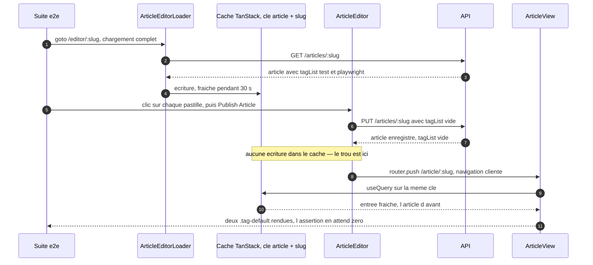

# Dossier de cadrage — #29 vider toutes les étiquettes d'un article à l'édition

## 0. Décisions de la porte Shape (2026-08-07)

Le cadrage est approuvé tel quel. Deux points laissés ouverts par l'analyse sont tranchés, et ne
sont pas à re-débattre en implémentation.

**Le correctif écrit l'article dans le cache, il n'invalide pas et ne touche pas à `staleTime`.**
`setQueryData(articleQueryKey(slug), saved)` avant la redirection : la page atteinte affiche l'état
que l'API vient de confirmer, sans aller-retour supplémentaire. Les deux alternatives sont écartées
pour la même raison — elles paient l'économie que l'ADR 015 revendique. Invalider forcerait un
refetch et un état de chargement après chaque enregistrement ; abaisser `staleTime` ferait passer le
test sans que la donnée cesse de venir d'un cache périmé, ce que la section 2 qualifie à juste titre
de triche.

**La conséquence négative est consignée en amendant l'ADR 020, pas dans un nouvel ADR.** La décision
et son coût réel vivent au même endroit, ce que la convention d'amendement du dépôt prévoit ; un ADR
séparé fragmenterait une décision unique sur deux documents que le prochain lecteur devrait
rapprocher. Un commentaire dans `content-query.ts` seul a été écarté : la rule 21 veut qu'une
convention s'écrive là où elle est décidée.

## 1. Problème

`articles.spec.ts:229` — « should remove all tags when editing an article » — échoue sur `staging`, et
il n'appartient à aucun des cinq lots que le verdict de #10 avait répartis. Tant qu'il n'a pas de lot,
la définition de terminé de #11 (« les cinq lots fermés, la suite verte ») est inatteignable, et #17
— la bascule du job de conformité en gate — avec elle. C'est le sixième lot, d'un seul échec.

Ce n'est pas une régression : l'échec précède la vague courante. Il manquait au découpage parce que le
verdict d'origine avait été lu plutôt que mesuré.

## 2. Contraintes

- **La suite vendorée ne s'édite jamais** ([ADR 018](../../../docs/adr/018-conformite-e2e-suite-officielle-vendoree.md),
  [ADR 016](../../../docs/adr/016-suite-de-conformite-vendoree.md)) : `pnpm conformance:drift` compare
  la copie à l'amont octet pour octet. Une assertion qui échoue est un défaut du front, jamais un
  défaut du test. Le test e2e est la **cible**, pas la preuve.
- **Contourner l'assertion par un autre chemin est la même triche que l'éditer.** Ramener `staleTime`
  à zéro pour cette clé ferait passer le test sans que la donnée affichée cesse de venir d'un cache
  périmé : c'est traiter le symptôme mesuré par la suite, pas la propriété qu'elle mesure.
- **Cycle req-driven ([rule 20](../../../.claude/rules/20-requirements-docs-as-code.md))** : REQ amendé
  d'abord, tests par couche rouges ensuite, implémentation jusqu'au vert, portion e2e constatée en
  dernier.
- **Impact minimal ([rule 03](../../../.claude/rules/03-commits-review.md))** : un seul échec à payer.
  La surface touchée doit rester celle qui le produit.
- **La frontière de rendu de l'[ADR 020](../../../docs/adr/020-chargement-client-des-pages-de-contenu.md)
  n'est pas remise en cause** : `/article/:slug` et `/editor/:slug` restent chargées depuis le
  navigateur. Le défaut vit **dans** cette frontière, pas dans son tracé.
- **Le préchargement serveur de l'[ADR 015](../../../docs/adr/015-prechargement-serveur-et-hydratation-du-cache.md)
  n'est pas remis en cause non plus** : `staleTime: 30_000` existe pour lui, et l'abaisser annulerait
  l'économie d'aller-retour que cet ADR revendique.
- **Markup RealWorld** ([rule 11](../../../.claude/rules/11-design-realworld.md)) : aucun markup ne
  change dans ce lot. Le DOM de l'éditeur et celui de la page article sont déjà conformes au gabarit.
- **Collision de surface** : `apps/web/src/components/ArticleEditor.tsx` vient d'être réécrit par #27
  (REQ-WEB-019, `useAuthenticatedAccount`, `EDITOR_MESSAGES`), et #28 a remué le flux. Brancher sur
  `staging` à jour, pas sur l'état d'hier.

## 3. Hors-scope

- **Le transport de la liste vide.** `updateArticleDtoSchema` la laisse passer, l'use-case la traite
  (`[]` est *truthy*), le repository fait `set: []` puis reconnecte. Vérifié par l'issue, revérifié
  ici : après l'enregistrement, l'article est bien sans étiquette en base.
- **Le markup de l'éditeur.** `ArticleEditor.tsx` rend
  `.tag-list > span.tag-default.tag-pill > button > i.ion-close-round` : le sélecteur du test
  correspond, et le clic sur le `i` remonte au bouton qui filtre l'étiquette.
- **L'ordre de peuplement des champs**, piste avancée par le corps de l'issue. `ArticleEditorLoader`
  ne rend **aucun** champ tant que la requête est en attente : quand `input[name="title"]` existe avec
  une valeur, les pastilles sont déjà là (§4.1). Cette piste est close, pas reportée.
- **Les entrées de flux** (`FEED_QUERY_PREFIX`) après un enregistrement : elles se réparent seules à
  la navigation, et pour une raison démontrable (§4.4). Y toucher serait du travail sans effet
  observable, sur une surface que #28 vient de remuer.
- **Le cache après une suppression d'article** (`AuthorActions.remove`) : même famille de défaut,
  aucun test du lot ne l'exerce, et ce n'est pas le geste de cette issue. Candidat à une issue propre.
- **Le fil de commentaires orphelin** laissé sous l'ancien slug après un renommage : inatteignable —
  la section n'est montée que si l'article charge, et l'ancien slug répond 404. Noté, pas traité.
- **La bascule du job CI en gate** : #17, décidée après plusieurs runs verts consécutifs
  ([rule 21](../../../.claude/rules/21-cadre-reproductible.md), étape 3).

## 4. Analyse technique

### 4.0 Le point de mesure a bougé, une deuxième fois

`staging` porte désormais `ccdbeec` (#27, lot I12) et `ab77fbf` (#28, lot I13). Le premier réécrit
`ArticleEditor.tsx` (compte retenu, messages du contrat §10), le second touche le flux et l'URL. Aucun
des deux ne change ce qui suit — vérifié fichier par fichier sur la tête actuelle — mais le réflexe de
la [rule 02](../../../.claude/rules/02-workflow-dev.md) tient : **rejouer le test avant d'écrire une
ligne** (slice 1). Le dépôt a déjà payé deux fois le prix d'un verdict pris sur un artefact qui
n'était pas celui qu'on croyait tester.

### 4.1 Ce que les trois hypothèses écartées démontrent en creux

L'issue a éliminé le markup, le transport de la liste vide et la persistance. Ces trois vérifications
sont justes, et leur conjonction est plus informative que chacune prise seule : **l'article est bien
enregistré sans étiquette**, et pourtant la page qui suit en affiche deux. Le défaut n'est donc ni
dans le clic ni dans l'enregistrement — il est dans **ce que la page suivante lit**.

La quatrième hypothèse du corps de l'issue (les étiquettes peuplées après le titre, donc une boucle
qui compte zéro et sort sans rien supprimer) est fausse elle aussi, et pour une raison structurelle :

```tsx
// apps/web/src/components/ArticleEditorLoader.tsx
if (article.isPending) {
  return (/* … Loading article… — aucun champ rendu */)
}
return <ArticleEditor article={article.data} />
```

Le chargeur ne monte l'éditeur qu'une fois l'article résolu. `input[name="title"]` n'existe donc jamais
avant les pastilles : quand le test cesse d'attendre sur le titre, les `.tag-pill` sont dans le DOM, et
la boucle supprime bien les deux étiquettes.

### 4.2 La cause : une entrée de cache fraîche que l'enregistrement ne met pas à jour

Trois faits, tous lisibles dans le dépôt :

1. `ArticleEditorLoader` charge l'article sous la clé **partagée** `articleQueryKey(slug)` —
   `['article', slug]` — délibérément la même que celle de la page article
   (`apps/web/src/lib/content-query.ts`, docblock).
2. `apps/web/src/lib/api-provider.tsx` pose `staleTime: 30_000` sur toutes les requêtes. Une entrée
   écrite il y a moins de trente secondes est **fraîche** : `useQuery` la sert et **ne refetch pas**.
3. `ArticleEditor.submit` appelle `api.updateArticle(...)` puis
   `router.push('/article/' + saved.slug)`. Il **n'écrit rien dans le cache** et n'invalide rien — le
   composant n'importe même pas `useQueryClient`.

Composés : le navigateur ouvre `/editor/:slug` par un chargement complet (`QueryClient` neuf), le
chargeur écrit l'article **avec ses deux étiquettes** dans `['article', slug]`, l'auteur retire les
pastilles et publie, `router.push` fait une navigation **cliente** — même document, même
`QueryClient` — et `ArticleView` monte sur la même clé. L'entrée a moins de trois secondes. Elle est
fraîche. La page rend l'article **d'avant l'enregistrement**, étiquettes comprises.

`expect(page.locator('.tag-list .tag-default')).toHaveCount(0)` réessaie, mais rien ne changera : il
n'y a aucune requête en vol à attendre. L'échec est **déterministe**, pas intermittent.



### 4.3 Pourquoi ce test tombe et pas son frère

`articles.spec.ts:50` — « should edit an existing article » — traverse le même éditeur et il est
**vert**. La différence tient en une ligne :

```js
const updates = { title: `Updated ${article.title}`, … };  // :50 — le titre change
```

La règle R-1 fait dériver le slug du titre : `saved.slug` diffère de celui d'origine, donc
`router.push` mène à une **autre clé de cache**, vide, donc chargée depuis l'API. Le test de #29, lui,
ne touche pas au titre : même slug, même clé, entrée fraîche. Le défaut n'est atteignable que par un
enregistrement **à titre inchangé** — ce qui explique qu'il ait survécu à toute la suite jusqu'ici, et
qu'il n'ait été trouvé qu'en mesurant.

### 4.4 Ce que l'ADR 020 a retiré sans le nommer

Avant l'[ADR 020](../../../docs/adr/020-chargement-client-des-pages-de-contenu.md), la page article
chargeait au rendu **serveur** puis hydratait le cache. Ce trajet portait une réparation implicite :
`hydrate` de `@tanstack/query-core` remplace une entrée existante dès que la donnée déshydratée est
plus récente —

```ts
// node_modules/@tanstack/query-core/src/hydration.ts:240
if (state.dataUpdatedAt > query.state.dataUpdatedAt || hasNewerSyncData) { query.setState(…) }
```

— donc toute navigation vers une page préchargée écrasait le cache client avec ce que le serveur
venait de lire. Une entrée périmée ne survivait pas à une navigation. **L'accueil et les listes
gardent cette réparation** ([ADR 015](../../../docs/adr/015-prechargement-serveur-et-hydratation-du-cache.md)),
et c'est précisément pourquoi les entrées de flux sont hors-scope (§3).

Les trois routes déplacées par l'ADR 020 l'ont perdue. Sur elles, **le cache client fait autorité** :
si une mutation n'y écrit pas, plus rien ne corrige. L'ADR liste trois conséquences négatives (contenu
absent du HTML initial, 404 devenu 200, premier affichage plus tardif) ; celle-ci n'y figure pas. Elle
mérite une ligne d'amendement — c'est le rôle que la
[rule 21](../../../.claude/rules/21-cadre-reproductible.md) donne au registre des décisions, et c'est
ce qui évitera au prochain déplacement de route de redécouvrir le même trou.

### 4.5 Un commentaire du dépôt affirme l'invariant que ce lot doit rendre vrai

```ts
// apps/web/src/lib/api-provider.tsx, docblock de staleTime
* Ce n'est pas un cache de fraîcheur — les mutations mettent l'affichage à jour
* depuis la réponse de l'API, sans attendre un refetch.
```

`ArticleMeta` le tient : la bascule de favori écrit la réponse dans `articleQueryKey(article.slug)`.
`ArticleEditor` ne le tient pas. L'affirmation est donc fausse pour le seul écran de l'application où
l'utilisateur **produit** du contenu — celui où voir son propre travail non pris en compte coûte le
plus cher. Le correctif ne consiste pas à écrire une règle nouvelle : il applique celle que le dépôt
énonce déjà, à l'endroit où elle a été oubliée.

### Matrice des effets observables

| Transition | Entrée de cache du slug renvoyé | Entrée de cache du slug d'origine | Page article atteinte par la redirection |
|---|---|---|---|
| Ouverture de `/editor/:slug` | N/A | peuplée par le chargeur avec l'article d'avant modification, fraîche 30 s — inchangé | N/A |
| Publication d'une création | aujourd'hui absente ; demain **écrite depuis la réponse** | N/A | aujourd'hui écran d'attente puis contenu ; demain contenu immédiat, sans aller-retour |
| Modification publiée, titre inchangé | aujourd'hui conserve l'article d'avant et reste fraîche, donc **aucun refetch** ; demain porte la réponse | même entrée que la colonne précédente, le slug n'ayant pas changé | aujourd'hui l'article d'avant pendant 30 s ; demain l'article enregistré |
| Modification publiée, titre changé donc slug régénéré | absente, donc chargée depuis l'API — inchangé | aujourd'hui conserve un article qui n'existe plus sous ce slug ; demain **retirée** | correcte sur le nouveau slug — inchangé ; un retour arrière vers l'ancienne URL affiche aujourd'hui un article fantôme, demain son absence |
| Retrait de toutes les étiquettes, titre inchangé | aujourd'hui la `tagList` d'avant ; demain `[]` | même entrée, le slug n'ayant pas changé | aujourd'hui deux `.tag-list .tag-default`, **l'échec mesuré** ; demain zéro |
| Publication refusée par l'API | aucune écriture — inchangé | aucune écriture — inchangé | N/A, il n'y a pas de redirection |

### Décision à trancher au gate — où écrire, et quoi

| Option | Trade-off |
|---|---|
| **A — écrire la réponse dans le cache, via un helper de `content-query.ts` (recommandée)** | La réponse de l'API fait autorité, zéro aller-retour, et c'est le geste exact que `ArticleMeta` pose déjà pour le favori. Le helper vit à côté des clés qu'il écrit, comme `invalidateAuthorCaches` : « quelles vues partagent une entrée » est une propriété du modèle de cache, pas de l'écran qui enregistre. Coût : un `useQueryClient` dans l'éditeur, et un `QueryClientProvider` à ajouter à sa spec. |
| B — invalider l'entrée au lieu de l'écrire | Correct, mais paie un aller-retour et laisse l'ancien contenu affiché pendant sa durée : `staleTime` sert la donnée périmée pendant la revalidation. Le test finirait par passer sur réessai, l'auteur verrait quand même ses étiquettes revenir une fraction de seconde. Contredit le docblock de §4.5. |
| C — abaisser `staleTime` sur la clé `article` | Fait passer le test sans corriger la propriété qu'il mesure, et annule pour cette clé l'économie que l'ADR 015 revendique. C'est traiter le thermomètre (§2). Écartée. |

Sous-question rattachée à A : que faire de l'entrée du **slug d'origine** quand le titre a changé ? La
retirer (`removeQueries`) plutôt que l'écraser — la ressource n'existe plus sous ce slug, et une
entrée fraîche qui la décrit encore servirait un article fantôme à qui revient en arrière.

## 5. Critères d'acceptation (binaires)

- [ ] **REQ-WEB-014 / AC-8** — Given un auteur qui publie depuis l'éditeur, en création comme en
      modification, When l'API répond, Then l'article renvoyé est écrit dans l'entrée de cache de son
      slug **avant** la redirection — la page article atteinte affiche le contenu enregistré sans
      attendre de rafraîchissement.
- [ ] **REQ-WEB-014 / AC-9** — Given une modification qui retire toutes les étiquettes sans toucher au
      titre, When la redirection amène sur la page de l'article, Then aucune pastille n'est rendue, y
      compris à l'intérieur de la fenêtre de fraîcheur de trente secondes.
- [ ] **REQ-WEB-014 / AC-10** — Given une modification qui change le titre, donc le slug, When
      l'enregistrement réussit, Then l'entrée de cache du slug d'origine est retirée — revenir à
      l'ancienne URL n'affiche pas un article qui n'y existe plus.
- [ ] **REQ-WEB-014 / AC-11** — Given une publication refusée par l'API, When l'erreur arrive, Then
      aucune entrée de cache n'est modifiée et la saisie reste à l'écran — l'affichage continue de
      décrire le dernier état que l'API a confirmé.
- [ ] **Sortie de lot** — Given `staging` à jour et le harnais e2e, When
      `pnpm conformance:e2e articles.spec.ts` est exécuté, Then `articles.spec.ts:229` passe et aucun
      test de ce fichier qui passait avant ne régresse.

## 6. Breadboard

**Places**

- `apps/web/src/lib/content-query.ts` — accueille le helper d'écriture, à côté de `articleQueryKey` et
  de `invalidateAuthorCaches`, qu'il rejoint en nature. Signature pressentie :
  `cacheSavedArticle(queryClient, saved, previousSlug?)` — écrit `articleQueryKey(saved.slug)` depuis
  la réponse, et retire `articleQueryKey(previousSlug)` quand le slug a changé.
- `apps/web/src/components/ArticleEditor.tsx` — dans `submit`, entre la réponse et `router.push`.
  Seul point d'appel : c'est là que la réponse existe. Le reste du composant, y compris ce que #27
  vient d'y poser, n'est pas touché.
- `docs/requirements/functional/web/REQ-WEB-014.md` — AC-8 à AC-11, `implementation.files` étendu à
  `content-query.ts`, `related.issues` complété par 29.
- `docs/adr/020-chargement-client-des-pages-de-contenu.md` — une ligne dans « Consequences /
  Negative » : les trois routes déplacées perdent la réparation par hydratation, donc toute mutation
  qui les concerne doit écrire dans le cache.

**Affordances / seams**

- L'appel se fait **avant** `router.push` : après, la page cible est déjà en train de lire.
- `ArticleEditorLoader` — non touché. Il reste le producteur de l'entrée à l'ouverture ; c'est son
  écriture que celle de l'éditeur vient remplacer.
- `ArticleView` et `ArticleMeta` — non touchés. Le contrat de lecture ne change pas ; seule l'entrée
  qu'ils lisent devient juste.
- `apps/web/src/lib/feed-query.ts` — **non touché**, et c'est un choix argumenté (§4.4), pas un oubli.

**Tests par couche** ([rule 16](../../../.claude/rules/16-tests-coverage.md))

- `apps/web/src/lib/content-query.spec.ts` — le helper : écriture sous le slug renvoyé, retrait de
  l'ancien quand il diffère, absence de retrait quand il est identique. AC-8, AC-10.
- `apps/web/src/components/ArticleEditor.spec.tsx` — AC-8, AC-9, AC-11. La spec ne monte aujourd'hui
  qu'un `SessionProvider` : elle devra envelopper le rendu d'un `QueryClientProvider` et rendre le
  client à l'appelant pour lire l'entrée après publication, comme le fait déjà
  `apps/web/src/app/settings/page.spec.tsx`. Sans ce provider, l'ajout de `useQueryClient` fait
  **échouer les tests existants** : symptôme attendu de la slice 3, pas une régression.
- Anti-tautologie : chaque test doit échouer contre le code d'avant. Celui d'AC-9 s'écrit en
  pré-remplissant le cache avec l'article étiqueté, exactement comme le chargeur le fait.

## 7. Slices

1. **Mesurer avant d'écrire** — `pnpm conformance:e2e articles.spec.ts` sur `staging` à jour.
   Consigner le message d'échec exact et le nombre de `.tag-default` observé. Discriminant décisif et
   gratuit : **recharger la page de l'article** après l'échec. Si les étiquettes disparaissent au
   rechargement, la donnée est juste côté API et le défaut est bien le cache (§4.2) ; si elles
   persistent, c'est le cadrage qu'il faut reprendre, pas le plan. Aucune ligne de code ici.
2. **REQ d'abord** — amender `REQ-WEB-014` (AC-8 à AC-11, `implementation`, `related.issues`).
   `pnpm requirements:validate` vert.
3. **Helper et appel** — tests de couche rouges dans `content-query.spec.ts` puis
   `ArticleEditor.spec.tsx` (avec le `QueryClientProvider` que l'ajout rend nécessaire), puis
   `cacheSavedArticle` et son appel dans `submit`. Système cohérent en fin de slice.
4. **Amender l'ADR 020** — la conséquence négative non listée (§4.4). Une ligne, dans le registre qui
   la porte.
5. **Constater la cible** — `pnpm conformance:e2e articles.spec.ts`. C'est ici, et seulement ici, que
   la portion e2e devient une preuve.
