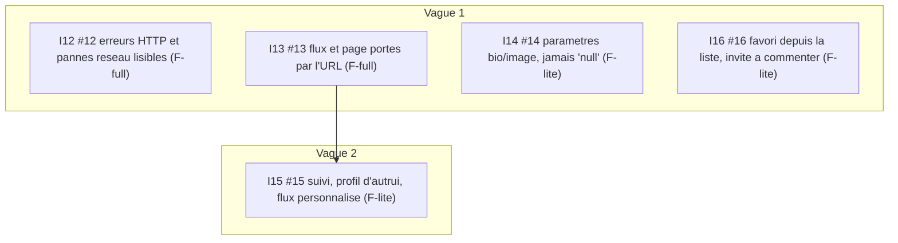

# Graphe d'exécution — epic #11

Graphe **reconstruit** depuis les issues GitHub déjà matérialisées (#12 à #16), et non produit par
`decompose.workflow.js` : re-décomposer un PRD aurait fabriqué un second graphe concurrent de celui
qui vit déjà dans le tracker. Aucun panel de juges n'a donc tourné sur ce graphe.

**#17 est délibérément hors périmètre de ce run.** Sa condition de bascule n'est pas seulement
« #11 fermée » mais « quelques runs verts consécutifs » — une fenêtre de mesure qu'aucune vague
automatisée ne peut fournir en enchaînant sur le merge de #16. La bumper au jour 1 est exactement ce
que la [rule 21, étape 3](../../../.claude/rules/21-cadre-reproductible.md) interdit. Elle est
remontée en suivi manuel à la clôture de l'epic.

## Tiers

Les tiers ci-dessous sont un **jugement de cadrage**, pas une lecture de labels : aucune issue enfant
ne porte de label `size:*` (c'est le manque G8 constaté au scan de readiness). À rectifier en posant
les labels si le jugement ne tient pas.

| ref | issue | tier | bloquée par | vague | portée |
|---|---|---|---|---|---|
| I12 | [#12](https://github.com/kamangacode/conduit-fullstack/issues/12) erreurs HTTP et pannes réseau lisibles | F-full | — | 1 | 24 échecs · api-client, provider d'auth, tous les formulaires, mode dégradé |
| I13 | [#13](https://github.com/kamangacode/conduit-fullstack/issues/13) flux et page portés par l'URL | F-full | — | 1 | 11 échecs · accueil, pagination, préchargement serveur (ADR 015) |
| I14 | [#14](https://github.com/kamangacode/conduit-fullstack/issues/14) paramètres bio/image, jamais « null » | F-lite | — | 1 | 8 échecs · paramètres, profil |
| I16 | [#16](https://github.com/kamangacode/conduit-fullstack/issues/16) favori depuis la liste, invite à commenter | F-lite | — | 1 | 3 échecs · aperçu d'article, commentaires |
| I15 | [#15](https://github.com/kamangacode/conduit-fullstack/issues/15) suivi, profil d'autrui, flux personnalisé | F-lite | I13 | 2 | 4 échecs · social, dépend de `?feed=following` |

## Dépendance déclarée

Une seule arête : **I15 ← I13**. Elle est écrite dans le corps de #15 (« Ce lot dépend probablement
de #13 : le flux personnel est aussi ce que `?feed=following` doit sélectionner »). Le flux personnel
ne peut pas être vérifié de bout en bout tant que le flux n'est pas sélectionnable par l'URL.

## Risque de collision en vague 1

Les quatre issues de la vague 1 vivent toutes dans `apps/web`. #12 touche l'api-client et chaque
formulaire, donc recouvre largement la surface de #14 et #16. Le portail de conflit du moteur de
vagues sérialise les collisions (départage par numéro croissant) : attendre une vague 1 plus proche
du séquentiel que ce que le diagramme suggère. C'est le moteur qui fonctionne, pas une panne.

## Graphe

## Définition de terminé

Les cinq lots fermés et la suite `pnpm conformance:e2e` verte. La bascule du job CI en gate (#17)
reste un acte séparé, à décider après quelques runs verts consécutifs.
