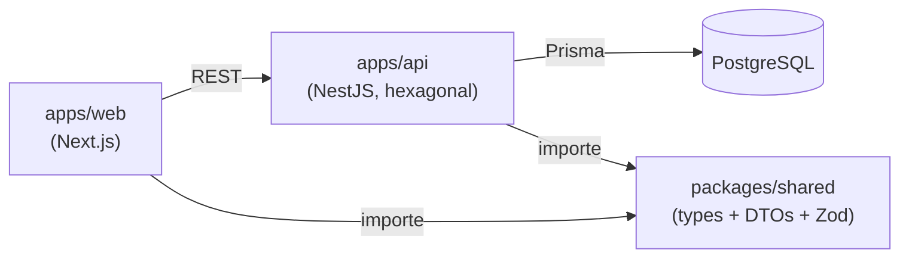
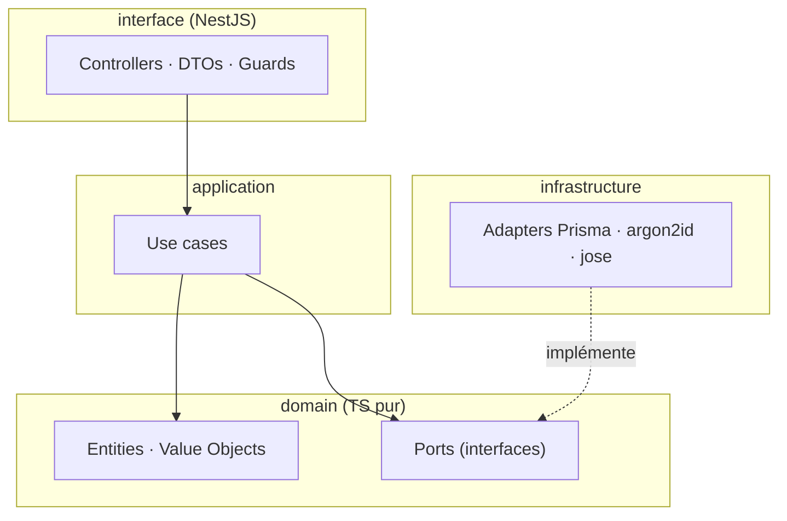
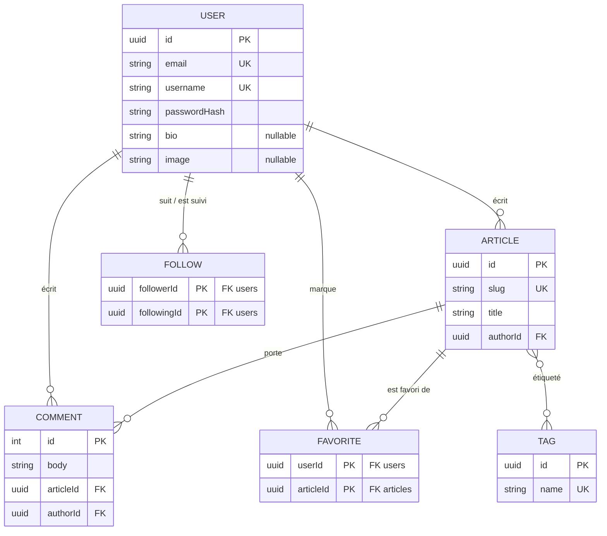
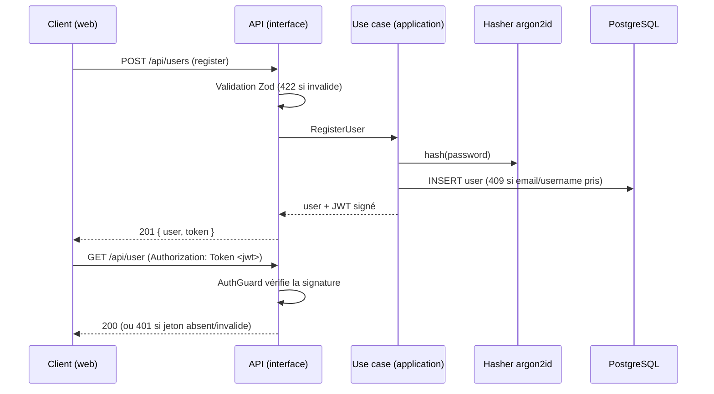

# Diagrammes d'architecture (as code)

> Diagrammes versionnés en **mermaid** : ils vivent dans le dépôt, se relisent en revue
> comme du code, et se mettent à jour dans la même PR que le changement qu'ils décrivent.
> GitHub les rend nativement.

## Topologie du monorepo

Le modèle Conduit est écrit **une seule fois** dans `packages/shared` et importé des deux
côtés : la cohérence front/back est une dépendance de compilation, pas un contrat à
maintenir en double (voir [ADR 001](../adr/001-topologie-monorepo-modele-partage.md)).

## Couches de l'API (architecture hexagonale)

Le `domain` est pur : aucun import de NestJS ni de Prisma. Les dépendances pointent
toujours **vers l'intérieur** ; la frontière est vérifiée mécaniquement par
`dependency-cruiser`.

## Modèle de données (ERD)

Reflète [`apps/api/prisma/schema.prisma`](../../apps/api/prisma/schema.prisma)
([ADR 002](../adr/002-modele-donnees-prisma.md)). `Comment.id` est le seul identifiant
entier du modèle, par alignement sur le contrat officiel ([ADR 004](../adr/004-persistance-alignee-sur-le-contrat.md)).

## Flux d'authentification

Inscription/connexion : hachage **argon2id**, émission d'un JWT signé (`jose`) porté
ensuite par l'en-tête `Authorization: Token <jwt>` ([ADR 007](../adr/007-authentification-argon2id-jose.md)).

## Références

- [ADR 001 — topologie monorepo](../adr/001-topologie-monorepo-modele-partage.md)
- [ADR 002 — modèle de données](../adr/002-modele-donnees-prisma.md)
- [ADR 007 — authentification argon2id / jose](../adr/007-authentification-argon2id-jose.md)
- Syntaxe : <https://mermaid.js.org>
